# Blog <!-- Metadata: type: Outline; created: 2026-09-20 07:17:46; reads: 38; read: 2026-09-20 07:33:23; revision: 38; modified: 2026-09-20 07:33:23; importance: 0/5; urgency: 0/5; -->
News and articles about MindForger - one post per [release](RELEASES.md), newest first.

## Nerdview for the MindForger documentation  <!-- Metadata: type: Note; created: 2026-09-20 07:20:01; reads: 19; read: 2026-09-20 07:33:23; revision: 19; modified: 2026-09-20 07:33:23; -->

*2026-09-19*

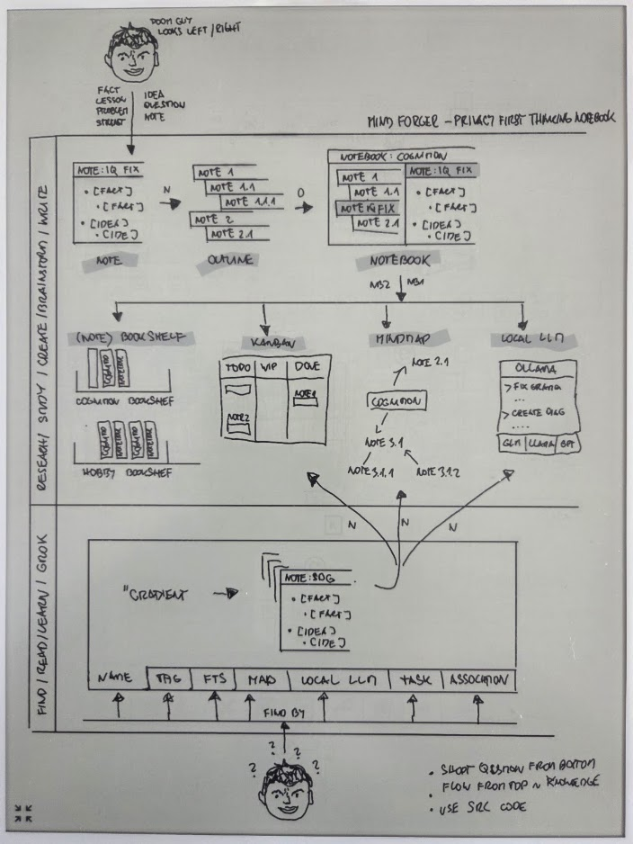

To have some fun I prepared MindForger functional architecture overview
diagram. I used my beloved [SuperNote](https://supernote.com/) Yoda to sketch the diagram
and then turned it to the animated diagram which is now available as
[Nerdview](https://mindforger.com/#overview) on the web.

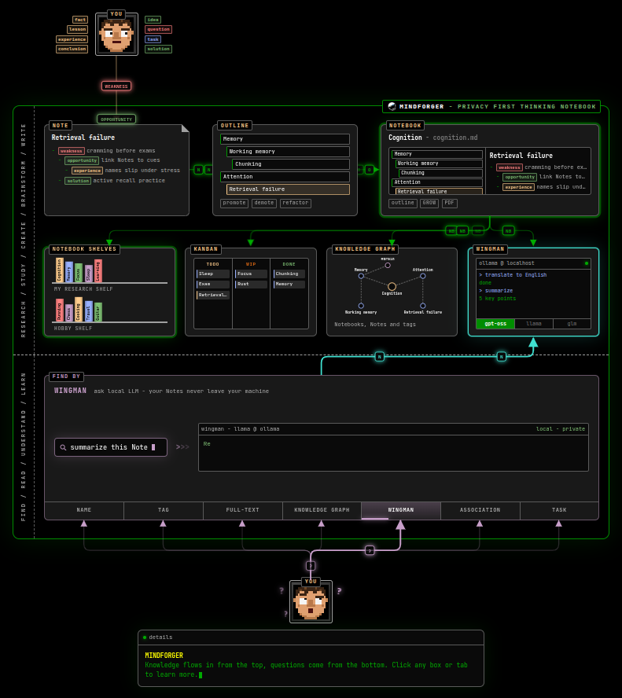

The diagram is animated - it shows the flow and how ideas, facts, experiences ... are turned to Notes, Notes to Notebooks with the outline, then organized to (note)book shelves and browsed
in the knowledge graph, kanban and/or processed by Wingman.

## MindForger 2.2.0: Rewrap, Snap, WebEngine, KaTeX and Mermaid <!-- Metadata: type: Note; created: 2026-09-20 07:17:46; reads: 6; read: 2026-09-20 07:25:57; revision: 1; modified: 2026-09-20 07:17:46; -->

*2026-09-13* | [release on GitHub](https://github.com/dvorka/mindforger/releases/tag/2.2.0)

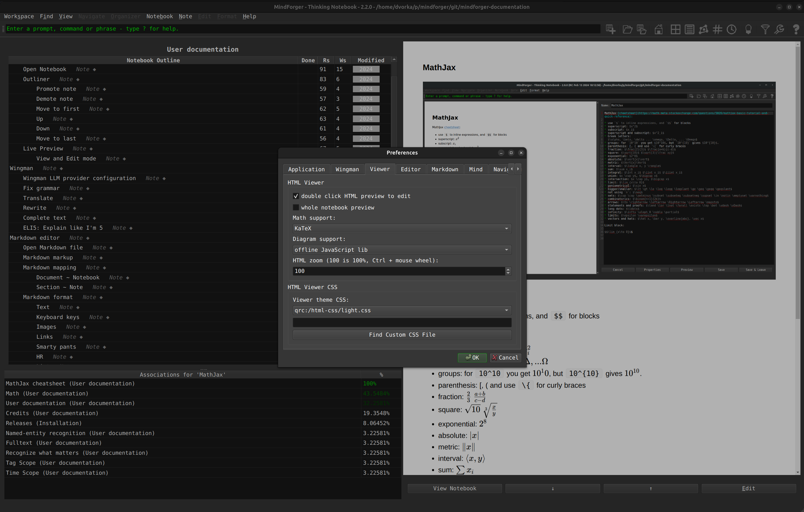

[MindForger](https://www.mindforger.com/)  is getting back in shape! This **minor** release brings significant stabilization and performance improvements, which MindForger has desperately needed for some time. I fixed long standing bugs and accelerated Markdown to HTML rendering. I switched MindForger from the legacy, slow, and fragile HTML rendering engine (`QtWebKit` fork abandoned in 2018 which I kept for Linux distro backward compatibility) to the latest and greatest one (`QtWebEngine`) which has been used by Windows and macOS for years. I also fixed and sped up math, source code, and diagrams rendering by switching to SOTA libraries, upgrading to the latest versions and fixing what was broken.

* **Editation**
    * `Rewrap Paragraph` fills the paragraph/rewraps the paragraph under the cursor to 80 columns.
    * Easily add emojis by clicking associated button when adding new Notebook/Note or editing Notebook/Note name or description.
* **Markdown to HTML rendering**
    * Qt WebEngine, which is ~8x faster than Qt WebKit, is newly default HTML rendering backend on Linux as it already was on Windows and macOS.
    * **Math** support now offers KaTeX (fast, offline @ QT resources included MF binary) and MathJax (legacy, upgraded, offline) instead of online CDN dependency.
    * Offline Mermaid **diagram** rendering works again - mermaid.js was not registered as a Qt resource, so it always silently failed. Online option removed.
* **Autolinking**
    * Colors of autolinking generated Note/Outline interlinks are in blue.
    * Bare http(s):// URLs containing Markdown-special characters (e.g. '_') got backslash-escaped by the autolinking preprocessor's Markdown round-trip which corrupted the result - fixed by verbatim using CommonMark's <...>.
* **Snap**      
    * Menu/toolbar icons are no longer missing in the strict Snap.

## MindForger 2.1.0: Snap, Autolinking colorization and Wingman <!-- Metadata: type: Note; created: 2026-09-20 07:17:46; reads: 1; read: 2026-09-20 07:17:46; revision: 1; modified: 2026-09-20 07:17:46; -->

*2026-09-03* | [release on GitHub](https://github.com/dvorka/mindforger/releases/tag/2.1.0)

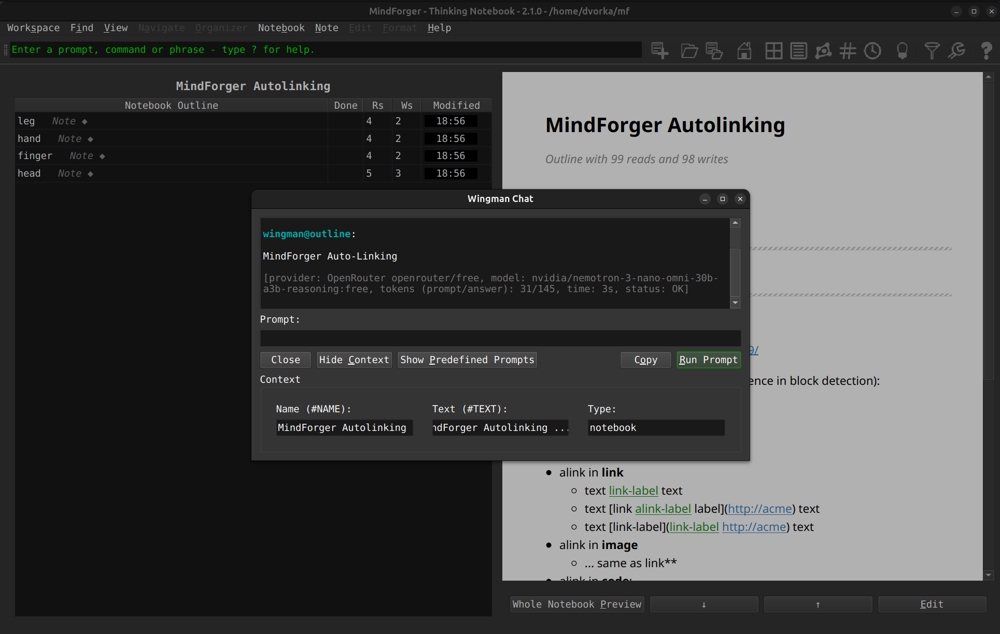

This **minor** [MindForger](https://www.mindforger.com/) release brings improved autolinking, **Snap** distribution, new local **large language models** providers, various fixes and small enhancements:

* **Autolinking**
    * Manual links are newly rendered in a different color than
      autolinker created links.
* **Snap**
    * Install MindForger either from the [snapcraft.io](https://snapcraft.io/mindforger) (strict confinement) or by downloading the `.snap` (classic confinement).
* **Wingman**:
    * Added Ollama as local LLM provider (privacy) and OpenRouter as new remote LLM provider (100s of SOTA models).    
* **Fixes and enhancements**:
    * Check various [minor fixes](https://github.com/dvorka/mindforger/blob/2.1.0/Changelog) and [enhancements](https://github.com/dvorka/mindforger/blob/2.1.0/Changelog).

## MindForger 2.0.0: Wingman, Notebooks Tree and Libraries <!-- Metadata: type: Note; created: 2026-09-20 07:17:46; reads: 1; read: 2026-09-20 07:17:46; revision: 1; modified: 2026-09-20 07:17:46; -->

*2024-02-16* | [release on GitHub](https://github.com/dvorka/mindforger/releases/tag/2.0.0)

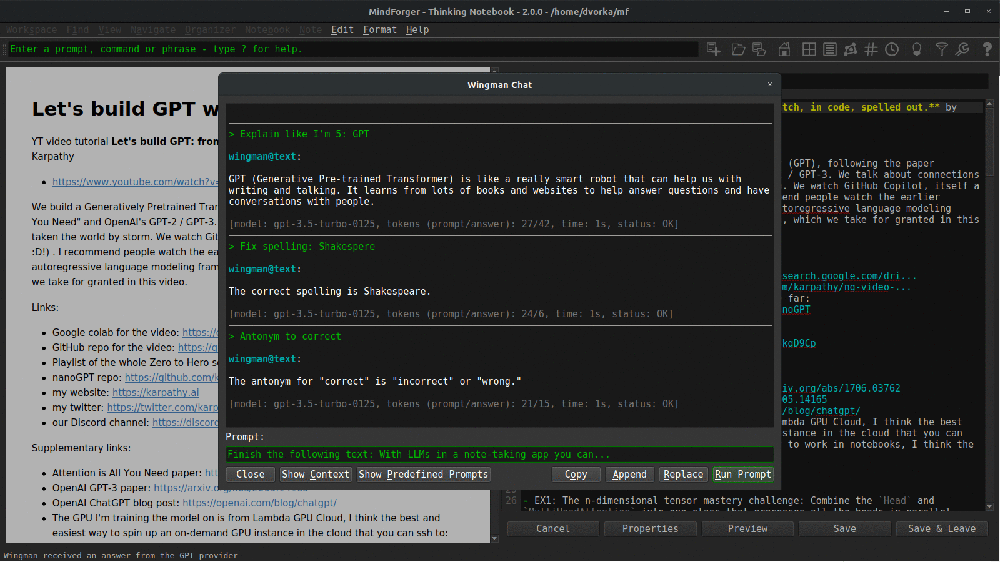

This **major** [MindForger](https://www.mindforger.com/) release brings **wingman**, **notebooks tree** and **libraries**:

* **Wingman**:
    * **Wingman** is MindForger's integration with large language models which brings note-taking and knowledge management to the next level. MindForger newly allows you to easily expand your notes and knowledge by leveraging the power of artificial intelligence. Whether you need to prepare a plan, write an in-depth analysis, draft a blog post, or simply generate ideas. Large language model can [fix grammar](https://www.youtube.com/watch?v=QLX9CWzzEa8&list=PLkTlgXXVRbUDdvysdslnAt_mU15oNPWNS&index=5&pp=iAQB), [translate](https://www.youtube.com/watch?v=akesdLhWZ-I&list=PLkTlgXXVRbUDdvysdslnAt_mU15oNPWNS&index=7&pp=iAQB), [write](https://www.youtube.com/watch?v=eyLV5P_Bujs&list=PLkTlgXXVRbUDdvysdslnAt_mU15oNPWNS&index=6&t=5s&pp=iAQB), [reformulate](https://www.youtube.com/watch?v=eyLV5P_Bujs&list=PLkTlgXXVRbUDdvysdslnAt_mU15oNPWNS&index=6&t=5s&pp=iAQB) [summarize](https://www.youtube.com/watch?v=TAV8tHajjeg&list=PLkTlgXXVRbUDdvysdslnAt_mU15oNPWNS&index=9&pp=iAQB), suggest [synonyms and antonyms](https://www.youtube.com/watch?v=Xj0wZz2vBSw&list=PLkTlgXXVRbUDdvysdslnAt_mU15oNPWNS&index=10&pp=iAQB), and much more. You can effortlessly generate high-quality content, and enhance the organization of your knowledge.
* **Notebooks tree**:
    * With **Notebooks tree**, you can organize notebooks in a tree (outline) just like notes in notebooks.
    * By using a tree-like structure, you can organize your notebooks in a logical and **hierarchical** manner, similar to how folders and subfolders organize files on a computer. This allows you to break down your knowledge into smaller, more manageable chunks and helps you find and access specific information easily.
    * Structuring notebooks to form a tree promotes better organization and clarity. You can create a top-level notebook, representing a **broad** topic or category, and then create sub-notebooks within it to represent **more specific** subtopics or subcategories. This hierarchical arrangement enables you to maintain a clear overview of your knowledge and facilitates navigation within your notebooks.
* **Libraries**:
    * Library (directory with files) bring ability to index external PDF files and generate Notebooks which represent them in MindForger. 
    * The notebook representing the PDF allows easy access to the PDF notebook. Notebook can be used to write ideas, thoughts and remarks related to the PDF document.
    * Synchronization of the library is supported as well.
* **Web search**
    * Find knowledge for a term under the cursor, selected in the text or notebook/note name, on the internet: Wikipedia, arXiv, GitHub, or StackOverflow.
* **Fixes and enhancements**:
    * Check also other [minor fixes](https://github.com/dvorka/mindforger/blob/dev/2.0.0/Changelog) and [enhancements](https://github.com/dvorka/mindforger/milestone/68?closed=1).

[May you do good, not evil.](https://github.com/dvorka/mindforger/blob/dev/2.0.0/app/src/qt/mindforger.cpp)

## MindForger 1.54.0: Smart(er) Markdown editor and macOS fixes <!-- Metadata: type: Note; created: 2026-09-20 07:17:46; reads: 1; read: 2026-09-20 07:17:46; revision: 1; modified: 2026-09-20 07:17:46; -->

*2022-03-07* | [release on GitHub](https://github.com/dvorka/mindforger/releases/tag/1.54.0)

This [MindForger](https://www.mindforger.com/) release brings  **smart(er) Markdown editor** and significantly improved **macOS** version:

* **smart(er) editor**:
    * `{[("'~` completion
    * bulleted task lists completion
    * automatic bulleted and numbered lists indentation on <kbd>ENTER</kbd>
    * multi-line code fences completion
    * <kbd>TAB</kbd> indentation to SPACE @ TAB multiple
    * selected block of text rigid left/right move with <kbd>TAB</kbd>/<kbd>Shift-TAB</kbd>
* improved **macOS** version:
    * from Linux style to macOS style application and Markdown editor shortcuts
    * added new menu shortcuts for actions like new Notebook and Note refactoring
    * main window is not wider than screen on the application boot
    * polished MindForger logo and menu `icns` icons (transparency)
    * dark look & feel theme used by default
    * Qt downgraded from 5.9.9 (security, macOS only)
* **loss of data** prevention:
    * `RD_ONLY` file detection with warning
    * click to a preview link while editing opens dialog allowing to save changes
    * reviewed non-repository (Markdown file or directory mode) UI ensures that MindForger repository specific actions are not available and unsupported (meta)data cannot be lost
* **UX:**
    * <kbd>Page up</kbd>, <kbd>Page down</kbd>, <kbd>Home</kbd> and <kbd>End</kbd> navigation in Notebook, Notes and Recent tables
    * Kanban and Eisenhower matrix selection model and navigation allow at most one row selection
    * Kanban and Eisenhower items can be moved around columns with keyboard shortcuts
    * view/edit bottom buttons work even if "double-click to edit" is disabled
    * toolbar is not hidden on window minimization and visibility preferences are correctly persisted in the configuration
    * Emacs editor keybinding enhancements: <kbd>^-y</kbd>, <kbd>alt-w</kbd>, <kbd>^-w</kbd> and <kbd>alt-d</kbd>
    * Vim keybinding removal
* various other [minor fixes](https://github.com/dvorka/mindforger/blob/dev/1.54.0/Changelog) and [enhancements](https://github.com/dvorka/mindforger/milestone/68?closed=1).

[May you do good, not evil.](https://github.com/dvorka/mindforger/blob/master/app/src/qt/mindforger.cpp) 🇺🇦

## MindForger 1.53.0: Spell check + Kanban and Eisenhower Matrix on tags + CSV OHE export + µ terminal <!-- Metadata: type: Note; created: 2026-09-20 07:17:46; reads: 1; read: 2026-09-20 07:17:46; revision: 1; modified: 2026-09-20 07:17:46; -->

*2021-12-26* | [release on GitHub](https://github.com/dvorka/mindforger/releases/tag/1.53.0)

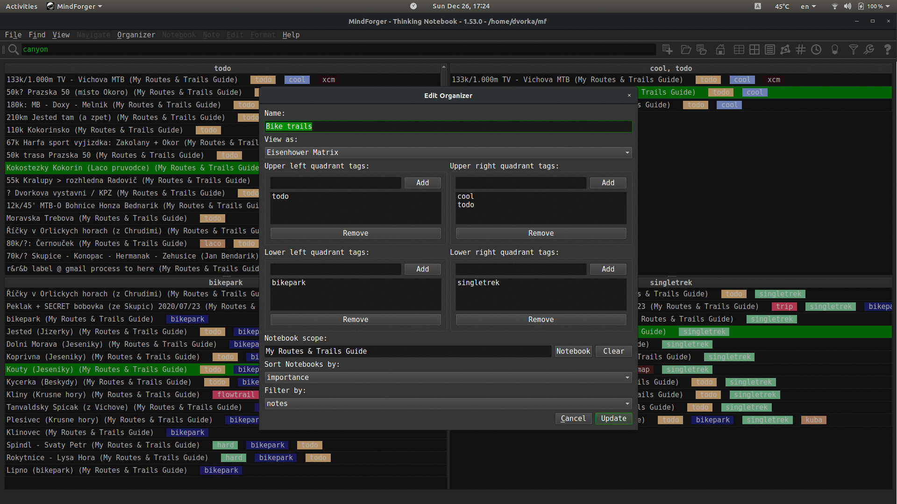

This **major** [MindForger](https://www.mindforger.com/) release brings:

* [Hunspell](http://hunspell.github.io/)-based spell checking [👁](https://twitter.com/mindforger/status/1475139367329058816)
* [Kanban](https://en.wikipedia.org/wiki/Kanban_(development)) style organizer of notebooks and/or notes on tags allowing you to plan and structure your learning [👁](https://twitter.com/mindforger/status/1457393862532599809)
* [Eisenhower Matrix](https://www.eisenhower.me/eisenhower-matrix/) organizer of notebooks and/or notes on tags to assess priorities
* ability to edit notes with external editor, WYSIWYG or tool [👁](https://twitter.com/mindforger/status/1457383960405843976)
* [CSV](https://en.wikipedia.org/wiki/Comma-separated_values) notes export with [one-hot-encoded](https://en.wikipedia.org/wiki/One-hot) tags which can be used to build [machine learning models](https://www.kdnuggets.com/2020/01/h2o-framework-machine-learning.html) for your remarks or any set of Markdown documents [👁](https://twitter.com/mindforger/status/1458671975891714060)
* minimal [terminal](https://en.wikipedia.org/wiki/Command-line_interface) allowing you to run commands directly from MindForger e.g. to push your knowledge to a Git repository or to run external applications
* configuration of custom CSS for Markdown to HTML rendering in viewer [👁](https://twitter.com/mindforger/status/1460360021166940164)
* repository specific configuration
* lazy (PDF) documents indexation POC
* various [minor fixes](https://github.com/dvorka/mindforger/blob/dev/1.53.0/Changelog) and [enhancements](https://github.com/dvorka/mindforger/milestone/68?closed=1)

## MindForger 1.52.0: Autolinking and macOS enhancements <!-- Metadata: type: Note; created: 2026-09-20 07:17:46; reads: 1; read: 2026-09-20 07:17:46; revision: 1; modified: 2026-09-20 07:17:46; -->

*2020-03-08* | [release on GitHub](https://github.com/dvorka/mindforger/releases/tag/1.52.0)

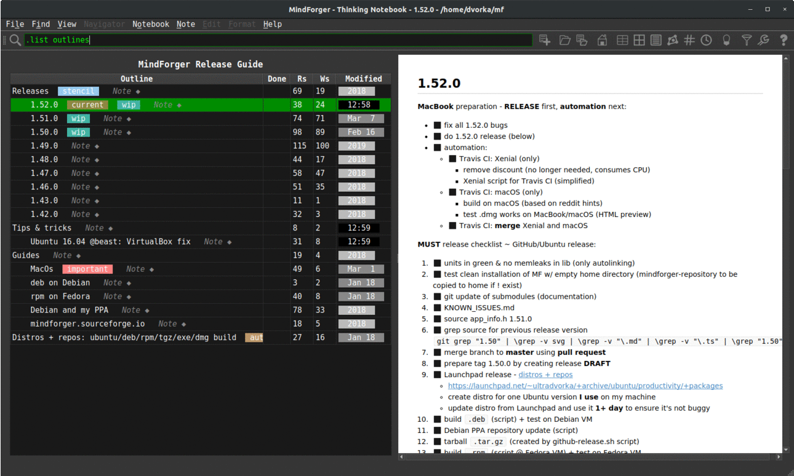

This **major** [MindForger](https://www.mindforger.com/) release brings:

* long awaited autolinking
* macOS enhancements
* several [minor fixes and improvements](https://github.com/dvorka/mindforger/milestone/59?closed=1).

**Autolinking** (automatic interlinking) injects links (Notebooks and Notes names ~ Markdown document names and section names) to your remarks. Released implementation is `cmark-gfm` and `Trie` based to achieve desired performance and ensure autolinked Markdown format integrity. It can be further improvement with additional research (like hierarchical/scope centric multi-link selection) and implementation enhancements (like Aho-Corasic text search).

Shortcuts, drag & drop and ability to [paste image](https://twitter.com/mindforger/status/1236394013542014979) (even an image selection) improved on **macOS**. Big thanks to **Petr Kozelka** who borrowed [MacBook](https://twitter.com/mindforger/status/1235813289080139776) to improve and fix macOS implementation!

## MindForger 1.51.0: Live preview <!-- Metadata: type: Note; created: 2026-09-20 07:17:46; reads: 1; read: 2026-09-20 07:17:46; revision: 1; modified: 2026-09-20 07:17:46; -->

*2020-02-17* | [release on GitHub](https://github.com/dvorka/mindforger/releases/tag/1.51.0)

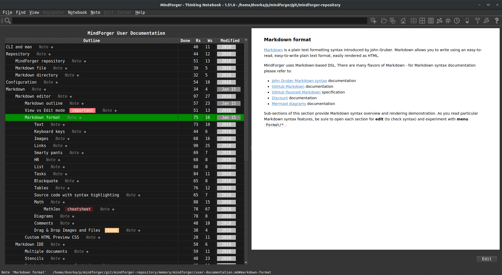

This [MindForger](https://www.mindforger.com) release brings:

* [Live preview](https://twitter.com/mindforger/status/1221886781299286016) of notes which is rendered as you write.
* **Persistent** Notebooks table sorting (column and order).
* **Whole** Notebook preview when switched to hoist mode.
* Improved [Mermaid diagram](https://twitter.com/mindforger/status/1223156770715193344/photo/1) support.

... and various minor [improvements and fixes](https://github.com/dvorka/mindforger/milestone/60?closed=1).

## MindForger 1.50.0: Dashboard, link completion, image drag & drop, FTS & toolbar revamp <!-- Metadata: type: Note; created: 2026-09-20 07:17:46; reads: 1; read: 2026-09-20 07:17:46; revision: 1; modified: 2026-09-20 07:17:46; -->

*2020-01-18* | [release on GitHub](https://github.com/dvorka/mindforger/releases/tag/1.50.0)

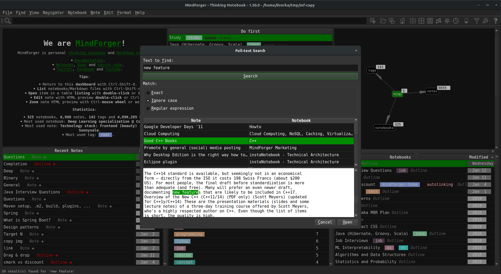

This major [MindForger](https://www.mindforger.com/) release brings:

* new [Dashboard view](https://twitter.com/mindforger/status/1211542588760694785)
* [FTS revamp](https://twitter.com/mindforger/status/1213567404149747720)
* drag&drop of images and attachments with copy to repository
* [CLI in toolbar](https://twitter.com/mindforger/status/1215387059122249728)
* Notebook and Note [link completion](https://twitter.com/mindforger/status/1216128131075125250) on <kbd>Ctrl+/</kbd>
* persistent hoist mode
* new [icons sets for menu](https://twitter.com/mindforger/status/1211546640898805761) and [toolbar](https://twitter.com/mindforger/status/1215387059122249728)

... several [bug fixes](https://github.com/dvorka/mindforger/milestone/44?closed=1) and usability enhancements.

I want to thank MindForger users for feedback, bug reports and constructive critics! Enjoy this new release!

## MindForger 1.49.0: Microsoft Windows and GitHub Flavored Markdown <!-- Metadata: type: Note; created: 2026-09-20 07:17:46; reads: 1; read: 2026-09-20 07:17:46; revision: 1; modified: 2026-09-20 07:17:46; -->

*2019-03-03* | [release on GitHub](https://github.com/dvorka/mindforger/releases/tag/1.49.0)

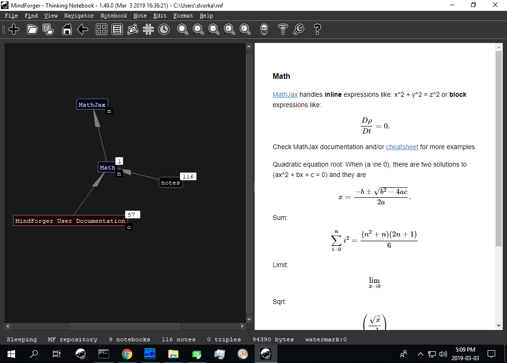

This major release brings **native** [Microsoft Windows](https://www.microsoft.com/windows) port of MindForger and support of [GitHub Flavored Markdown](https://github.github.com/gfm/) (via replacement of Discount with [mark-gfm](https://github.com/github/cmark-gfm) - GitHub's fork of cmark, a [CommonMark](http://commonmark.org/) parsing and rendering library).

Big thanks to [bonitoo.io](https://www.bonitoo.io/) and **Ivan Kudibal** who decided to contribute to MindForger -  kudos to **Vlasta _Šaman_ Hájek** who ported MindForger to Microsoft Windows in one month!

## MindForger 1.48.0: CSV Export, MathJax Menu and Autolinking Preview <!-- Metadata: type: Note; created: 2026-09-20 07:17:46; reads: 1; read: 2026-09-20 07:17:46; revision: 1; modified: 2026-09-20 07:17:46; -->

*2018-11-10* | [release on GitHub](https://github.com/dvorka/mindforger/releases/tag/1.48.0)

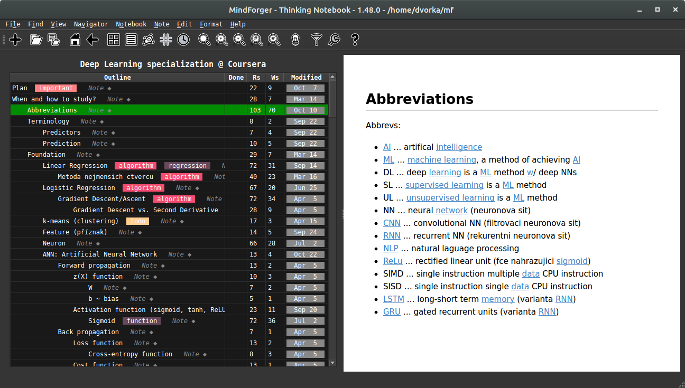

This MindForger release brings [CSV export](https://twitter.com/mindforger/status/1050352536081829888), [MathJax menu](https://twitter.com/mindforger/status/1049565072404729856), [HTML zooming](https://twitter.com/mindforger/status/1061677980219518976) and [autolinking preview](https://twitter.com/mindforger/status/1049998778420396032). **CSV export** enables AI/ML/DS analysis of your remarks. **MathJax menu** aims to significantly improve your productivity when writing mathematical expressions. **Autolinking** is an experimental feature which automatically **turns you plain text notes to hypertext** while your browse them. Autolinking automatically discovers notes across your repository with the right title and creates links (just for view, note is not changed).

## MindForger 1.47.0: Knowledge Graph Navigator <!-- Metadata: type: Note; created: 2026-09-20 07:17:46; reads: 1; read: 2026-09-20 07:17:46; revision: 1; modified: 2026-09-20 07:17:46; -->

*2018-10-02* | [release on GitHub](https://github.com/dvorka/mindforger/releases/tag/1.47.0)

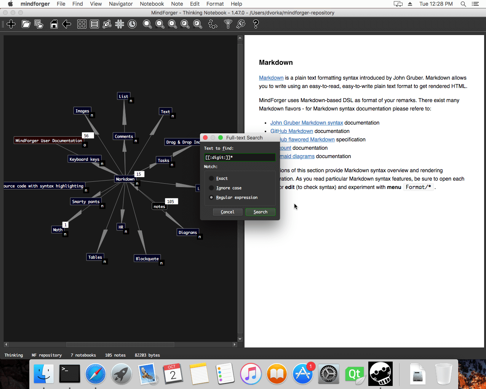

This major MindForger release brings knowledge graph navigator ([video](https://www.youtube.com/watch?v=ZbQmZ1fKpxI)), full-text search with regular expressions, HTML notebook export, TWiki document import, [Docker](https://github.com/dvorka/mindforger-repository/blob/master/memory/mindforger/installation.md#build-and-run-in-container-)-based distribution, significant improvements in [recent notes](http://www.mindforger.com/images/screenshots/recent.png) and asynchronous associations.

## MindForger 1.46.0: Standard Terminology and Toolbar <!-- Metadata: type: Note; created: 2026-09-20 07:17:46; reads: 1; read: 2026-09-20 07:17:46; revision: 1; modified: 2026-09-20 07:17:46; -->

*2018-09-02* | [release on GitHub](https://github.com/dvorka/mindforger/releases/tag/1.46.0)

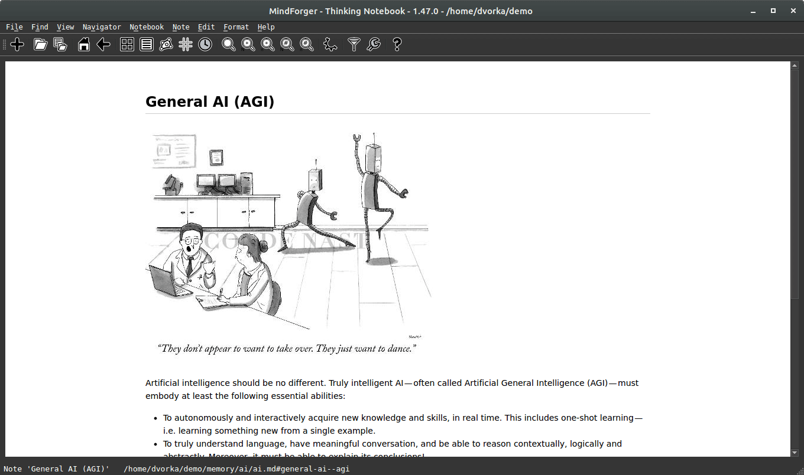

This release aims to improve MindForger usability. Terminology has been changed from nerd-style terms to commonly used naming. Newly added toolbar will make MindForger use much easier. In addition it lays the foundation for visual knowledge navigator. I also fixed several issues - both in frontend and backend.

## MindForger 1.43.0: Eisenhower Matrix, Tags View and Recent Notes <!-- Metadata: type: Note; created: 2026-09-20 07:17:46; reads: 1; read: 2026-09-20 07:17:46; revision: 1; modified: 2026-09-20 07:17:46; -->

*2018-07-10* | [release on GitHub](https://github.com/dvorka/mindforger/releases/tag/1.43.0)

This MindForger release brings [Eisenhower matrix](https://github.com/dvorka/mindforger-repository/blob/master/memory/mindforger/user-documentation.md#eisenhower-matrix-), tags view, recent notes view and [updated documentation](https://github.com/dvorka/mindforger-repository). 
In addition it lays the foundation for [named-entity recognition (NER)](https://github.com/dvorka/mindforger-repository/blob/master/memory/mindforger/user-documentation.md#named-entity-recognition-) and [knowledge graph navigator](https://github.com/dvorka/mindforger-repository/blob/master/memory/mindforger/user-documentation.md#knowledge-graph-navigator-). I also fixed several issues - both in frontend and backend (parsing huge repositories).

## MindForger 1.42.0: Initial MindForger Release <!-- Metadata: type: Note; created: 2026-09-20 07:17:46; reads: 1; read: 2026-09-20 07:17:46; revision: 1; modified: 2026-09-20 07:17:46; -->

*2018-05-30* | [release on GitHub](https://github.com/dvorka/mindforger/releases/tag/1.42.0)

I am happy to announce the first release of MindForger - the 4th generation of my thinking notebook. Rethought, redesigned and rewritten from scratch it becomes the tool I was dreaming about for years.

Although it's the first release, it brings several unique features and there is much more to come.

I didn't choose the date randomly - MindForger is released on the day of my 42nd birthday... and yes, it can confirm answer to the Ultimate Question of life, the Universe, and Everything!

Stay tuned - distribution/platform support, new features and demos will be releases in the upcoming weeks.
