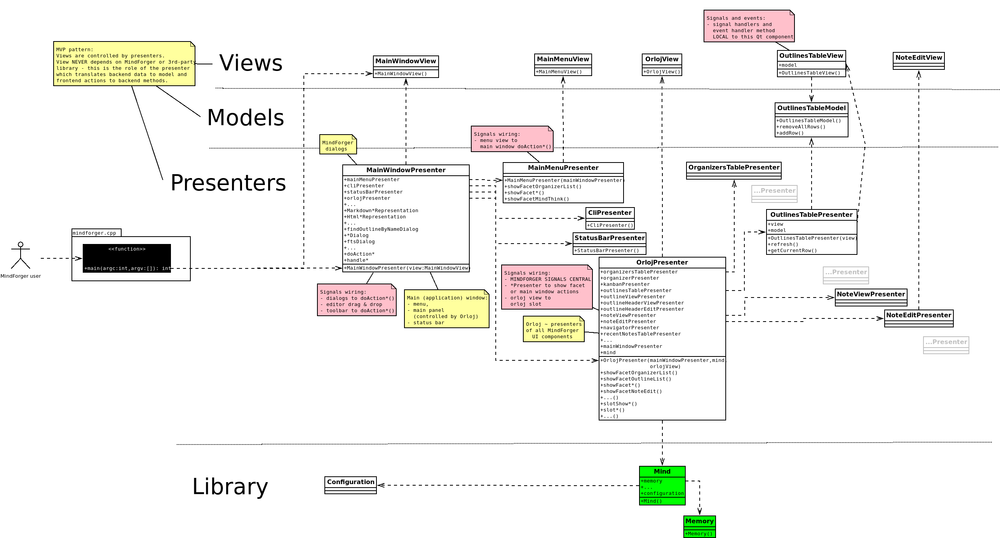

# Developer documentation <!-- Metadata: type: Outline; created: 2022-01-30 18:02:38; reads: 336; read: 2026-09-02 06:55:25; revision: 336; modified: 2026-09-02 06:55:25; importance: 0/5; urgency: 0/5; -->
> _"There are only two kinds of languages: the ones people complain about and the ones nobody uses" -- [Bjarne Stroustrup](https://www.stroustrup.com/quotes.html)_

MindForger is written in **C++** programming language.

Contribute:

* [Source code](https://github.com/dvorka/mindforger)
* [Build](#development-environment)
* [Technical architecture](#technical-architecture)

Specifications:

* [Repository Structure](#repository-layout)
* [Outline Format - Markdown hosted DSL](#markdown-hosted-dsl)

In case that you have any question or want to learn more about technical details
please don't hesitate to contact [me](mailto:martin.dvorak@mindforger.com).

# Contribute <!-- Metadata: type: Note; created: 2022-01-30 18:03:29; reads: 29; read: 2026-09-02 06:52:42; revision: 10; modified: 2022-01-30 18:06:39; -->
Current **MindForger** implementation is just an initial imperfect sketch of much broader **vision**. It's purpose is to **demonstrate** viability of thinking notebook idea and to **show** possible research directions.

Feel free to [contribute](https://www.mindforger.com)! Don't hesitate to contact [me](martin.dvorak@mindforger.com).

* **Bugs and suggestions**
    * Submit bugs, issues, ideas and enhancements.
* **Translations**
    * Translate MindForger to your favorite language.
* **Platform support**
    * Port MindForger to your favorite OS or distribution.
* **Code**
    * Submit pull request or patch with implementation of a feature you missed.
* **Research**
    * Consider making your AI/ML, NLP, data mining, ... research on top of (your) documents indexed to MindForger ontology.
* **Integration**
    * How-to or code enabling integration with your (favorite) project.
* **Enhancements**
    * Submit performance, efficiency and/or productivity enhancements.
* **Documentation**
    * Write a document, blog post or tweet, create YouTube video, ...
# Linux development environment <!-- Metadata: type: Note; created: 2022-01-30 18:02:38; reads: 47; read: 2026-09-02 06:52:43; revision: 30; modified: 2022-08-27 07:39:36; -->
Perhaps you may find useful description of my development environment:

* Backend library:
    * Source: [GitHub](https://github.com/dvorka/mindforger)
    * Compiler: [GCC](https://gcc.gnu.org)
    * Compilation speed-up: `ccache` (set in `QtCreator` as `ccache g++`)
    * Make: `qmake` + `make`
    * IDE: [QtCreator](https://www.qt.io/product/development-tools)
      (my own build w/ Emacs-style keyboard shortcuts - find it on GitHub)
    * Debugger: `gdb`
    * Leaks: `valgrind`
    * Profiler: GCC + [gprof](https://web.eecs.umich.edu/~sugih/pointers/gprof_quick.html)
    * Unit tests: [Google Test Framework](https://github.com/google/googletest)
* Qt GUI frontend:
    * Compiler: [GCC](https://gcc.gnu.org)
    * Make: `qmake` + `make`
    * IDE: [QtCreator](https://www.qt.io/product/development-tools)
        * `Tools/Options/Fonts`: vim dark, 12pt, zoom: 100%
        * `Whitespaces`: no tabs, visible, no traling whitespaces
        * "Borland Turbo C style help" for Qt via F1
    * Debugger:
        * QtCreator debugger
        * `gdb`
    * Unit tests: [Sikulix](http://sikulix.com/)
    * Editor: `Emacs` (quick edits w/ key bindings that enable my productivity)
        * set tabs for 4
        * no tabs just whitespaces
        * `alt-x compile` > `cd ../.. && make` (make -k for keep going)

For more details see the source code.
## Build <!-- Metadata: type: Note; created: 2022-01-30 18:02:38; reads: 43; read: 2026-09-02 06:55:25; revision: 7; modified: 2026-09-02 06:55:25; -->
See [build on Ubuntu](INSTALLATION.md#build-on-ubuntu) for how to build MindForger:

```
make build-dev
```

**Unit tests** are conducted by the [gtest](https://github.com/google/googletest) framework. Download, build and optionally install this framework before building MindForger unit tests.


## Tests <!-- Metadata: type: Note; created: 2022-01-30 18:02:38; reads: 41; read: 2026-09-02 06:55:11; revision: 10; modified: 2026-09-02 06:54:51; -->
**Prerequisite**: [Google test framework](https://github.com/google/googletest)

1. Checkout `googletest` and go to the checkout:

```
cd googletest
```

2. Create/enter a build directory (skip mkdir if build/ already exists, as it does here):

```
mkdir -p build
cd build
```

3. Configure with CMake (Release build, install prefix /usr/local):

```
cmake -DCMAKE_BUILD_TYPE=Release ..
```

4. Build:

```
make -j$(nproc)
```

5. Install system-wide (needs root — this copies headers to /usr/local/include/gtest and /usr/local/include/gmock, and libs to /usr/local/lib):

```
sudo make install
```

6. Refresh the linker cache (usually not strictly required for static libs, but harmless):

```
sudo ldconfig
```

7. Verify the install:

```
ls /usr/local/include/gtest/gtest.h
ls /usr/local/lib/libgtest.a /usr/local/lib/libgtest_main.a
```

8. Set the env vars test-lib-units.sh requires, then run the tests:

```
export M8R_CPU_CORES=$(nproc)
export M8R_GIT_PATH=/home/dvorka/p/mindforger/git/mindforger
cd /home/dvorka/p/mindforger/git/mindforger/build
make test-lib
```

---

MindForger **tests**:

* library unit tests
* frontend GUI tests

**Library** unit tests:

* based on [Google test framework](https://github.com/google/googletest)
* located in `lib/test/src`
* can be run using `build/test-lib-units.sh` - see source code for running all/particular
  test w/ or w/o valgrind/gdb/...

**Frontend** library tests:

* based on [Sikulix](http://sikulix.com/)
* located in `app/test/sikulix`
* can be run using `build/test-gui.sh`

For more details check tests source code.
## Benchmarks <!-- Metadata: type: Note; created: 2022-01-30 18:02:38; reads: 19; read: 2026-09-02 06:37:44; revision: 1; modified: 2022-01-30 18:02:38; -->
MindForger has also library benchmarks:

* based on [Google test framework](https://github.com/google/googletest)
* located in `lib/test/benchmark`
* can be run using `build/test-lib-units.sh` - see script source code to run particular benchark.

Benchmarks are *disabled* by default - go to benchmark source code and remove `DISABLED_` prefix
from its name. For more details see Google test framework documentation and benchmarks source code.
## Packaging <!-- Metadata: type: Note; created: 2022-01-30 18:02:38; reads: 17; read: 2024-02-16 16:30:36; revision: 4; modified: 2022-08-27 07:36:11; -->
Scripts used to created packages for Linux distributions can be found in:

* Ubuntu: `build/ubuntu`
    * tarball > local binary/source deb build (pbuilder) > Launchpad
      upload > Launchpad PPA
* Debian: `build/debian`
    * tarball > local binary/source deb build > local [Aptly](https://www.aptly.info/) PPA > PPA snapshot
      upload to http://www.mindforger.com/debian
* Fedora: `build/fedora`
    * deb > `alien` conversion w/ postprocessing to RPM > upload as release asset

**Upstream tarball** is created in the same way as archive released via GitHub:

* GitHub release: `build/github`

Check `make` targets for MindForger supported platforms targets:

* `make help`
# Windows development environment <!-- Metadata: type: Note; created: 2022-01-30 18:02:38; reads: 15; read: 2024-02-16 16:30:37; revision: 6; modified: 2022-08-27 07:39:44; -->
Perhaps you may find useful description of my development environment:

* Source:
    * [GitHub](https://github.com/dvorka/mindforger)
* Compiler:
    * Microsoft Visual C++ compiler
* Make:
    * `qmake` + `cmake` + `make`
* Installer:
    * JRSoftware Inno Setup
* IDE:
    * Qt Creator
* Unit tests:
    * Google Test Framework

For more details see source code.
## Install prerequisites <!-- Metadata: type: Note; created: 2022-01-30 18:02:38; reads: 11; read: 2024-02-16 16:30:38; revision: 1; modified: 2022-01-30 18:02:38; -->

* [Microsoft Visual Studio](https://visualstudio.microsoft.com/downloads/) (Community Edition suffices), during installation add with C++ support (todo: detailed info or screenshot)
    * or [Windows 10 SDK] (untested)(https://developer.microsoft.com/en-us/windows/downloads/windows-10-sdk)
* Qt
    * Download [Qt for Windows](https://www.qt.io/download) - Open Source
    * During installation select:
        * Qt->Qt 5.12.x->MSVC 2017 64-bit
        * Qt-> Qt WebEngine
* [cmake](https://github.com/Kitware/CMake/releases/download/v3.13.4/cmake-3.13.4-win64-x64.msi)


Prepare MindForger sources:

* Checkout Mindforger
    * `git clone https://github.com/dvorka/mindforger.git`
    * `cd mindforger`
    * `git checkout dev/1.49.0-win`
* Init dependencies
    * `git submodule init`
    * `git supmodule update`

## Build dependencies <!-- Metadata: type: Note; created: 2022-01-30 18:02:38; reads: 14; read: 2024-02-16 16:30:39; revision: 4; modified: 2022-08-27 07:38:14; -->
Building dependecies is required only once, during initial building.

Build `cmake-gfm` - it requires `cmake` on the path.

* Goto `cmark-gfm` directory:
    * `cd deps\cmark-gfm`
* Use build directory:
    * `mkdir build`
    * `cd build`
* Generate build files:
    * `cmake -G "Visual Studio 15 2017 Win64" -DCMAKE_CONFIGURATION_TYPES=Debug;Release -DCMARK_TESTS=OFF -DCMARK_SHARED=OFF ..`
* Build both release and debug profiles
    * `cmake --build . --config Release -- /m`
    * `cmake --build . --config Debug -- /m`

## Build MindForger <!-- Metadata: type: Note; created: 2022-01-30 18:02:38; reads: 14; read: 2024-02-16 16:30:40; revision: 3; modified: 2022-08-27 07:39:16; -->
* Goto GitHub repository directory:
    * `cd $GIT\mindforger`
* Setup development environment in cmd line. Change path according to your MSVC 2017 and Qt installation
    * `"C:\software\Qt\5.12.0\msvc2017_64\bin\qtenv2.bat"`
    * `"C:\Program Files (x86)\Microsoft Visual Studio\2017\Community\VC\Auxiliary\Build\vcvars64.bat"`
* Generate make files:
    * `qmake -r mindforger.pro`
* Build MindForger:
    * `nmake`
* `.exe` binary will be stored in the `app\release` folder
### Plan for Windows build and distribution <!-- Metadata: type: Note; tags: remove; created: 2022-01-30 18:02:38; reads: 20; read: 2024-02-16 16:30:43; revision: 3; modified: 2022-08-27 07:39:57; -->
GitHub:

* milestone: https://github.com/dvorka/mindforger/milestone/10
* branch: https://github.com/dvorka/mindforger/tree/dev/1.49.0-win

2019/1 plan to port MindForger on Windows:

* [x] **development environment**:
    * document IDE, compiler and OS setup - QtCreator, LLVM (would be nice), Win10 (VM)
* [x] **backend lib build**:
    * rewrite using Qt to portable version (Qt is NOT intentionally used in backend now)
    * decide whether...
        * go with Qt functions on all platforms
        * conditional compilation which introduces Qt dependency for Win only
    * https://github.com/dvorka/mindforger/issues/77
* [x] (preview) **frontend build** to identify non-portable code:
    * skip MD 2 HTML rendering (avoid its compilation) w/
      `html_outline_representation.cpp` and `MF_NO_MD_2_HTML` define
    * skip HTML rendering (avoid its compilation)
    * https://github.com/dvorka/mindforger/issues/648
* [x] **MD 2 HTML rendering**:
    * refactor existing impl to iface & implementation allowing to switch renderer
    * migrate to `cmark-GFM` library ~ GitHub's MD 2 HTML renderer
* [x] HTML **viewer**:
    * Qt uses the same engine as on macOS (WebEngine vs. WebKit)
* [x] **full build** w/ lib, `cmark-GFM` and HTML viewer
* [x] Win **installer** (possibly Qt based)
* [ ] make MF real Win app:
    * keyboard shortcuts which follow Windows conventions
    * desktop integration which start associated app for opened attachments
      (PDF, GIF, ...)

Get **pre-release** user feedback:

* https://github.com/dvorka/mindforger/issues/632

## Running MindForger <!-- Metadata: type: Note; created: 2022-01-30 18:02:38; reads: 7; read: 2024-02-16 16:30:45; revision: 1; modified: 2022-01-30 18:02:38; -->
* Manual run outside of QtCreator requires adding Qt libraries and Zlib libraries to _PATH_. Zlib binaries are located in `$GIT\mindforger\deps\zlib-win\
  * Qt files. Change path according to your setup
    * `"C:\software\Qt\5.12.0\msvc2017_64\bin\qtenv2.bat"`
  * Zlib
    * `set "PATH=%PATH%;$GIT\mindforger\deps\zlib-win"`
  * Start MindForger
    * `app\release\mindforger.exe`

## Creating installer <!-- Metadata: type: Note; created: 2022-01-30 18:02:38; reads: 5; read: 2024-02-16 16:30:46; revision: 1; modified: 2022-01-30 18:02:38; -->
* Install [Inno Setup 5](http://www.jrsoftware.org/download.php/is-unicode.exe)
* Prepare development environment. Change path according to your Qt installation
  * `"C:\software\Qt\5.12.0\msvc2017_64\bin\qtenv2.bat"`
* Gather dependencies
  * `cd $GIT\mindforger`
  * `windeployqt app\release\mindforger.exe  --dir app\release\bin --no-compiler-runtime`
* Build installer. Change path to the _vcredist_x64.exe_ according to your setup.
  * `"c:\Program Files (x86)\Inno Setup 5\ISCC.exe" /Qp /DVcRedistPath="c:\Program Files (x86)\Microsoft Visual Studio\2017\Community\VC\Redist\MSVC\14.14.26405\vcredist_x64.exe" build\windows\installer\mindforger-setup.iss`
* the result is in the `app\release\installer` folder

## Building unit tests <!-- Metadata: type: Note; created: 2022-01-30 18:02:38; reads: 7; read: 2024-02-16 16:30:46; revision: 1; modified: 2022-01-30 18:02:38; -->
Unit tests are conducted by the [gtest](https://github.com/google/googletest) framework. Download, build and optionally install this framework before building MindForger unit tests.

Gtest is expected at `C:\Program Files\gtest-distribution` by default. If you have it somewhere else you have to update the `lib\test\src\src.pro` Qt project file to change path to gtest.

Than:

* Prepare development environment. Change path according to your Qt and MSVC 2017 installation
    * `"C:\software\Qt\5.12.0\msvc2017_64\bin\qtenv2.bat"`
    * `"C:\Program Files (x86)\Microsoft Visual Studio\2017\Community\VC\Auxiliary\Build\vcvars64.bat"`
* Go to project file
    * `cd $GIT\mindforger\lib\test`
* Generate make files
    * `qmake -r mindforger-lib-unit-tests.pro "CONFIG+=debug" "CONFIG+=mfdebug"`
* Build tests
    * `nmake`

### Running unit tests <!-- Metadata: type: Note; created: 2022-01-30 18:02:38; reads: 7; read: 2024-02-16 16:30:47; revision: 1; modified: 2022-01-30 18:02:38; -->
* Prepare environment
  * `set "PATH=%PATH%;$GIT\mindforger\deps\zlib-win"`
  * `set M8R_GIT_PATH=$GIT\mindforger`
* Run tests
  * `cd $GIT\mindforger`
  * `lib\test\src\debug\mindforger-lib-unit-tests.exe`


## Using scripts <!-- Metadata: type: Note; created: 2022-01-30 18:02:38; reads: 12; read: 2024-02-16 16:30:47; revision: 2; modified: 2022-03-10 08:40:47; -->
```
cd build/
make help
```

---

Alternatively, instead using of following above described manual steps, you can take advantage of batch files prepared for building and running MindForger, installer and unit tests. All the scripts are located in the ` $GIT\mindforger\build` folder:

* `build-app.bat`
* `build-cmake.bat`
* `build-installer.bat`
* `build-unit-tests.bat`
* `env.bat`
* `run-app.bat`
* `run-unit-tests.bat`

Most important is the `env.bat`. It's called by others and sets up command line environment. Ammend this file to change paths based on your setup. Other scripts are self-explanatory. The `run-unit-tests.bat` can also take any argument. This is usefull for passing options to the _gtest_ framework.


## Windows Continous Integration (CI) <!-- Metadata: type: Note; created: 2022-01-30 18:02:38; reads: 11; read: 2024-02-16 16:30:48; revision: 1; modified: 2022-01-30 18:02:38; -->
Continous Integration for Windows:

* [AppVeyor](https://ci.appveyor.com/project/dvorka/mindforger)
    * See also `appveyor.yml`
## Optional QtCreator build <!-- Metadata: type: Note; created: 2022-01-30 18:02:38; reads: 22; read: 2024-02-16 16:30:48; revision: 2; modified: 2022-08-27 07:40:22; -->
* Start Qt creator
* Open project `%GIT%\mindforger\mindforger.pro`
    * Enable **Desktop Qt 5.xx MSVC2017 64bit** build
    * Set the **Build Directory** to `%GIT%\mindforger`
* Build MSVC 2017 64-bit

* For setting debugger in QtCreator follow instructions in Qt documention [Setting Up Debugger](https://doc.qt.io/qtcreator/creator-debugger-engines.html)
    * CDB is part for Windows SDK. If you have only Visual Studio, it must be installed additionaly. Download [Windows 10 SDK](https://developer.microsoft.com/en-us/windows/downloads/windows-10-sdk) and select `Debugging Tools for Windows` only.


### QtCreator debugging <!-- Metadata: type: Note; created: 2022-01-30 18:02:38; reads: 11; read: 2024-02-16 16:30:49; revision: 1; modified: 2022-01-30 18:02:38; -->
* For setting debugger in QtCreator follow instructions in Qt
  documention [Setting Up Debugger](https://doc.qt.io/qtcreator/creator-debugger-engines.html)
* CDB is part for Windows SDK. If you have only Visual Studio, it must be installed additionaly.
  Download [Windows 10 SDK](https://developer.microsoft.com/en-us/windows/downloads/windows-10-sdk)
  and select `Debugging Tools for Windows` only.

# Conventions and BPs <!-- Metadata: type: Note; created: 2022-01-30 18:02:38; reads: 5; read: 2024-02-16 16:30:49; revision: 1; modified: 2022-01-30 18:02:38; -->
Conventions and best practices.
## Git and Branching Conventions <!-- Metadata: type: Note; created: 2022-01-30 18:02:38; reads: 7; read: 2024-02-16 16:30:50; revision: 3; modified: 2022-03-10 08:45:19; -->
Git:

* `master` is the main development branch
* source code in `master` branch must be always stable
* `master` branch contains the latest MindForger release source code
* new MindForger version `<major>.<minor>.<patch>` is developed in Git branch `dev/<major>.<minor>/<patch>`

Git branch naming convention:

* `feature-<related issue id>/<feature-name>`
    * feature branch
* `enhancement-<related issue id>/<enhancement-name>`
    * enhancement branch
* `bug-<related issue id>/<description>`
    * bug fix branch
* `benchmark-<related issue id>/<description>`
    * benchmark branch
* `platform-<release version>/<platform-name>`
    * platform support branch

* `dev/<release version>`
    * release development branch used **before** release (stable master)
* `stabilization/<release version>`
    * stable brach used **after** release (patch releases)
## Source documentation conventions <!-- Metadata: type: Note; created: 2022-01-30 18:02:38; reads: 9; read: 2024-02-16 16:31:32; revision: 1; modified: 2022-01-30 18:02:38; -->
Source code documentation conventions:

* Use Doxygen syntax in source code comments
  https://www.cs.cmu.edu/~410/doc/doxygen.html
# Technical Architecture <!-- Metadata: type: Note; created: 2022-01-30 18:02:38; reads: 28; read: 2024-02-16 16:31:38; revision: 3; modified: 2022-08-27 07:41:45; -->
MindForger **technical** architecture.
## Library <!-- Metadata: type: Note; tags: todo; created: 2022-01-30 18:02:38; reads: 21; read: 2024-02-16 16:31:38; revision: 3; modified: 2022-08-27 07:44:02; -->

### 3rd-party dependencies <!-- Metadata: type: Note; tags: todo; created: 2022-01-30 18:02:38; reads: 20; read: 2024-02-16 16:31:39; revision: 2; modified: 2022-08-27 07:43:58; -->

#### cmark-gfm <!-- Metadata: type: Note; created: 2022-01-30 18:02:38; reads: 17; read: 2024-02-16 16:31:40; revision: 1; modified: 2022-01-30 18:02:38; -->
MindForger uses [cmark-gfm](https://github.com/github/cmark-gfm) for rendering
of Markdown documents to HTML:

* cmark-gfm repository:
  https://github.com/github/cmark-gfm
* cmark-gfm repository clone:
  https://github.com/dvorka/cmark

Fixes to cmark-gfm:

* https://github.com/dvorka/cmark/commit/bc97db117ec777c112055bc55918b63a89efbb65
    - fix of MSVC 2017 build (Windows)
* https://github.com/dvorka/cmark/commit/f06d944d8e19816cce322ce87140f8c8cf2db89e
    - Removal of code blocks prefixing with language specification using
      "language-" to fix Mermaid integration and allow class specification
      w/o prefix which is not desired.

cmark-gfm versions used:

* 1.53.0 - onwards
    - 766f161ef6d61019acf3a69f5099489e7d14cd49
      `0.29.0.gfm.2` (September 16, 2021)
* ... - 1.52.0
    - https://github.com/dvorka/cmark/commit/3785191c3afb6cabd56776f6d6c73c90f3131d5d
      `0.28.3.gfm.20` (January 31, 2019) with aforementioned patches
* 1.42.0 - ...
    - MindForger used Discount for Markdown rendering priort cmark-gfm
### Markdown Recursive Descent Parser <!-- Metadata: type: Note; tags: todo; created: 2022-01-30 18:02:38; reads: 21; read: 2024-02-16 16:31:42; revision: 3; modified: 2022-08-27 07:44:11; -->

### NLP: Stemmer, Lexicon, BoW <!-- Metadata: type: Note; tags: todo; created: 2022-01-30 18:02:38; reads: 23; read: 2024-02-16 16:31:43; revision: 3; modified: 2022-08-27 07:43:50; -->

## GUI <!-- Metadata: type: Note; tags: todo; created: 2022-01-30 18:02:38; reads: 17; read: 2024-02-16 16:31:06; revision: 3; modified: 2022-08-27 07:43:42; -->

### Qt <!-- Metadata: type: Note; tags: todo; created: 2022-01-30 18:02:38; reads: 19; read: 2024-02-16 16:31:07; revision: 3; modified: 2022-08-27 07:43:38; -->

### Model View Presenter <!-- Metadata: type: Note; created: 2022-01-30 18:02:38; reads: 16; read: 2024-02-16 16:31:07; revision: 2; modified: 2022-08-27 07:43:34; -->

### Async UI updates <!-- Metadata: type: Note; tags: todo; created: 2022-01-30 18:02:38; reads: 13; read: 2024-02-16 16:31:09; revision: 3; modified: 2022-08-27 07:45:20; -->

### Localization <!-- Metadata: type: Note; created: 2022-01-30 18:02:38; reads: 11; read: 2024-02-16 16:31:10; revision: 1; modified: 2022-01-30 18:02:38; -->
Adding a new/updating existing MindForger l10n:

* Add translation name to `app/app.pro`: `TRANSLATIONS += resources/qt/translations/mindforger_en.ts`
* Run `lupdate mindforger.pro` - it will parse source code
  and prepare empty file for translations (later update). This is where is new translation
  written.
    * If `lupdate` is not present on Ubuntu, then install `sudo apt-get install qttools5-dev-tools`
* Edit translations using `linguist` tool e.g. `linguist mindforger_cs.ts`
* Run `lrelease app/app.pro` to release translations that might be used in build.
* Add translation `.qm` resource to `app/mf-resources.qrs`
* Build application.
* Test it:
    * `export LANGUAGE=cs_CZ && export LANG=cs_CZ.UTF-8 && ./mindforger`
    * `export LANGUAGE=pt_BR && export LANG=pt_BR.UTF-8 && ./mindforger`

See also:

* http://doc.qt.io/qt-5/internationalization.html
* http://doc.qt.io/qt-5/qtlinguist-hellotr-example.html
### Force-driven graph <!-- Metadata: type: Note; tags: todo; created: 2022-01-30 18:02:38; reads: 17; read: 2024-02-16 16:31:13; revision: 3; modified: 2022-08-27 07:45:13; -->

## Benchmarks <!-- Metadata: type: Note; tags: todo; created: 2022-03-10 08:39:32; reads: 25; read: 2024-02-16 16:31:13; revision: 3; modified: 2022-08-27 07:45:10; -->

# Formats specification <!-- Metadata: type: Note; created: 2022-01-30 18:02:38; reads: 27; read: 2024-02-16 16:31:14; revision: 1; modified: 2022-01-30 18:02:38; -->
MindForger can open **any** file that uses Markdown format. MindForger
can also open **any** directory that contains Markdown files (also
in its sub-directories).

However, you can use MindForger's [Markdown hosted DSL](#markdown-hosted-dsl) and
[repository format](#repository-format) to get much more (mind related) features.
## Markdown hosted DSL <!-- Metadata: type: Note; created: 2022-01-30 18:02:38; reads: 29; read: 2024-02-16 16:31:17; revision: 1; modified: 2022-01-30 18:02:38; -->
This section describes MD conventions that MindForger uses to store outlines.

Description:

* **metadata** added by MindForger are optional
   * if user deletes metadata, then they are not added
   * user may activate creation of metadata by adding <!-- METADATA --> (any case) just after section title
   * `Metadata` keyword is case **insensitive** i.e. any other variant is valid substituation e.g. `metadata`, `MetaData`
     or `METADATA`
* **tags** chosen to follow typical naming e.g. GMail (labels, keywords, ... forbidden)

Example:

```
# Canonical Message Similarity Code <!-- metadata: revision: 3; timestamp: 2016/3/31 13:54.45; keywords: sv, matcher -->

This document contains ideas related to the definition of similarity codes for
canonical messages.

## Requirements <!-- metadata: revision: 5; timestamp: 2016/3/31 13:54.45; category: IMPORTANT; type: note -->

... here comes a text.
```
## Repository layout <!-- Metadata: type: Note; created: 2022-01-30 18:02:38; reads: 29; read: 2024-02-16 16:31:17; revision: 3; modified: 2022-08-27 07:44:44; -->
Design goals:

* Repository specification SHOULD be general i.e. not bound to MindForger
  so that anybody can create it, use it and it won't be vendor specific.
* Repository format MUST be human friendly i.e. easy to create and read
  for a normal person.

Repository layout:

```
[ROOT]/
  memory/
    [DIRECTORY-NAME]/
      [OUTLINE-NAME].md                 ... Markdown is default MF format. Source code/markup free text can be inlined
                                            using three back apostrophes. Intentionally there is no txt, TWiki, HTML
                                            as outline format to keep focus (txt/.../HTML can be an attachment of empty
                                            MD file).
      [OUTLINE-NAME].[ATTACH-NAME].png  ... '.' is reserved character
      [OUTLINE-NAME].[ATTACH-NAME].jpg
      [OUTLINE-NAME].[ATTACH-NAME].gif
    ...
  limbo/
  stencils/
    ...
  mind/                                 ... Git ignored directory w/ indexed knowledge base
    index.mf                            ... MF's index can be fully rebuilt from
                                            repository content (file internals and
                                            Git index information), it is used by
                                            MF runtime (navigation, ...)
    fts/                                ... Lucene stores its files to here
      ...
  .gitignore
  README.md                             ... MF generated info for nice Git repo
                                            that can be customized by user
```

Example repository:

```
ROOT/
  outlines/
    My Example/
      frontend-design.twiki
      frontend-design.mockup.jpg
      repository-design.md
      repository-design.overview.png
      repository-design.structure.png
      ideas.txt
  mind/
  .gitignore
  index
  README.md
```

Description:

* repository is Git repository
* .gitignore prevents storing of big attachments and indices to Git
* DIRECTORY-NAME ... A-Z a-z 0-9 SPACE - _
* OUTLINE-NAME   ... A-Z a-z 0-9 SPACE - _
* directory is outline *label* - name directories to be nice labels:
   * do NOT use plurals: 'templates' is not good label > use 'template' instead
   * user lower case for normal adjectives (template, import) and upper case for
     names like MindForger or Systinet
* MindForger home screen == cloud of is outline and/or note *labels* (split screen).
* Extensions:
   * files w/ extensions that are not explicitly enumerated are ignored by Git (global ignore)
# Continuous Integration (CI) <!-- Metadata: type: Note; created: 2022-01-30 18:02:38; reads: 65; read: 2024-02-16 16:31:18; revision: 15; modified: 2022-02-05 15:25:21; -->
Multiple CI services are used to build, test and package MindForger.
## GitHub Actions <!-- Metadata: type: Note; created: 2022-02-05 15:16:44; reads: 42; read: 2024-02-16 16:31:19; revision: 6; modified: 2022-02-05 15:25:03; -->
GitHub Actions are used to build macOS DiskImaGe packages and tarballs:

* [GitHub Actions](https://github.com/dvorka/mindforger/actions)

See also [.github/workflows](https://github.com/dvorka/mindforger/tree/dev/master/.github/workflows).
## AppVeyor <!-- Metadata: type: Note; created: 2022-02-05 15:16:35; reads: 33; read: 2024-02-16 16:31:20; revision: 6; modified: 2022-02-05 15:25:00; -->
AppVeyor CI is used to build Windows installer:

* [AppVeyor](https://ci.appveyor.com/project/dvorka/mindforger)

See also [appveyor.yml](https://github.com/dvorka/mindforger/blob/master/appveyor.yml).
## Travis CI (condemned) <!-- Metadata: type: Note; created: 2022-02-05 15:18:35; reads: 28; read: 2024-02-16 16:31:24; revision: 7; modified: 2022-02-05 15:21:37; -->
Travis CI is no longer used due to (GitHub account related) privacy issues and coarse grained security:

* [Travis CI](https://travis-ci.org/dvorka/mindforger)

See also [.travis.yml](https://github.com/dvorka/mindforger/tree/master/build/travis-ci).
# Release automation <!-- Metadata: type: Note; created: 2022-01-30 18:02:38; reads: 22; read: 2024-02-16 16:31:24; revision: 2; modified: 2022-08-27 07:45:02; -->
This is analysis of release automation making MindForger release much
faster and less time consuming.

Release artifacts:

* **PPA Launchpad**
    * State: fully scripted
    * Todo:
        * Load version number from a central place (env script)
        * Call this script from central release script.
        * Add section to generated report of main release script w/ URLs of Launchpad distros.
* **PPA Debian (private)**
    * State: text how to.
    * Todo:
        * Load version number.
        * Write script which automates OLD version removal and new version add.
        * Write script which will upload and replace PPA over FTS/SFTP/scp
        * Add section to generated report of main release
* **.deb**
    * ...
* **.rpm**
    * ...
* **tarball**
    * ...


