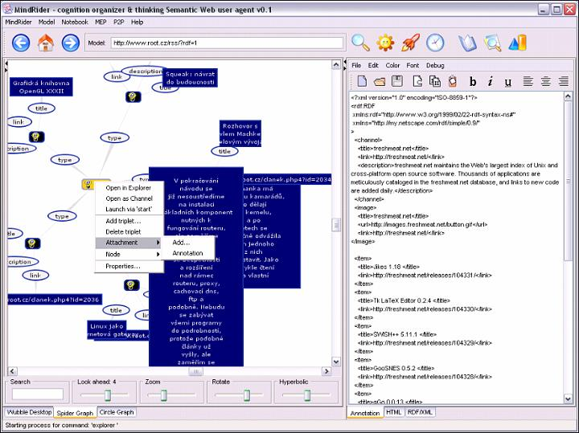
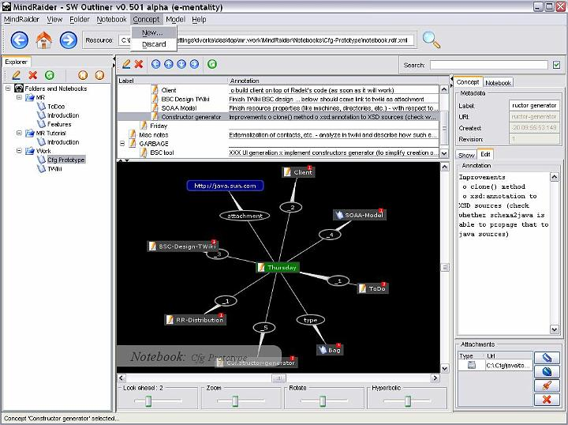
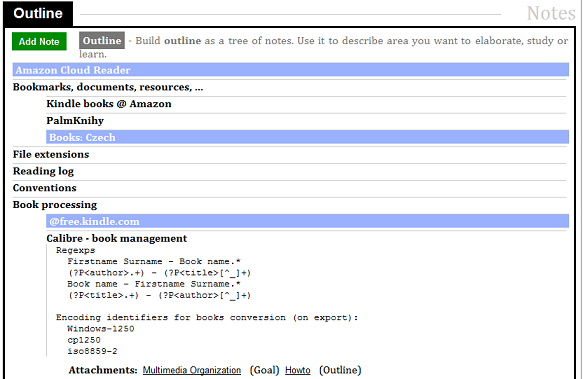
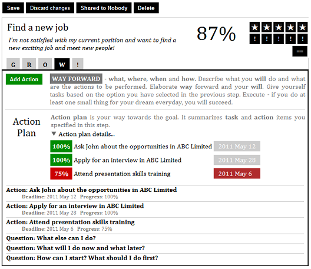

# Project History <!-- Metadata: type: Outline; created: 2022-01-26 23:42:26; reads: 363; read: 2022-03-10 08:34:42; revision: 363; modified: 2022-03-10 08:34:42; importance: 0/5; urgency: 0/5; -->
The story of the human mind inspired outliner is also an important
chapter in the story of my life.

It's the year 1996. It's early in the morning. I sit on a sofa and wait
for a college exercise to begin. Thinking about an interesting topic
and a piece of software to implement. How can I use what I learned in
recent two years at the college? It should be exciting, it should be
something from my domain, it must be something I will be using every
day... as a student.

A strange pale guy is limping through the corridor and sits
next to me. I have never seen him before and cannot remind him from any
past lecture. He stares at me through thick glasses and we start to talk about
this and that, about what exciting we have seen recently, getting to the
topics of our interest and finding that we actually have a lot in common...
and interest in the human mind in particular. We talk about old school
AI, and about an obvious gap in contemporary Office suites. We skip
the lecture and keep talking about the exciting ideas in a guild clubhouse.
We say goodbye excited, inspired and passionate. I don't remember his name,
but I remember that day until today very well. This was the last time
we met.

It's the year 1998. I'm waiting in from of a session room for an
old professor whose lectures I will be attending in the following 4 semesters
to come. He excels in mathematical analysis, received the highest academic awards,
then he got fascinated by the human mind, gave up mathematics, turned into a rebel
and started to study his own mind and also the mind of his 4 years old grandson.
Discussing various aspects of the human mind, cell model, neural networks
four hours every week for two years. He is skeptical, he often enters the
room smiling aloud while having Nature magazine in his hand - making fun
of an experiment of US scientists who sliced the brain of a poor prisoner who was
sentenced to death and trying to understand how the mind works. He compares
it to the experiments with his grandson, self-observation, emotions analysis
and primitive reflex backgrounds.

It's the year 2003. I'm joining my colleagues at work and we make a big Amazon
order to make it cheaper. I order [Pinker](https://stevenpinker.com/)'s
[How the Mind Work](https://en.wikipedia.org/wiki/How_the_Mind_Works) and
Gärdenfors's [Conceptual Spaces: The Geometry of Thought](https://mitpress.mit.edu/books/conceptual-spaces).
Great books, but this is not what I'm looking for...

It's the year 2004. I'm excited by the semantics web. Reading all available
literature, articles (including the one in
[Scientific American](https://www.scientificamerican.com/article/the-semantic-web/)
and web pages written by Tim Berners-Lee, going deep
into RDF, ontologies and DARPA-funded technologies and specs. Reminding
my college encounter thinking about putting the technology and ideas together.

I'm googling, [putting together various libraries](#rdf-spiders),
learning about force-directed graphs, coding overnight and
in early mornings while my girlfriend sleeps next to me. Happy days.

It's the year 2005. I just released [MindRaider](#mindraider) with buzzwordish pitch
"semantic web outliner" on SourceForge. My first open-source project.
I have a good feeling of being able to do something myself without any help.
I don't expect any response - the project is fresh meat, unstable,
with no documentation and UI that nobody (except the author ~ me) can
understand. I'm afraid that someone will be using it... but
at the same time I'm curious. I got a splash of emails - getting 10s of
emails in 2 weeks after the release. People from around
the world - including postgraduates and researchers - are writing about
MindRaider, asking questions, want to understand it, integrate and cooperate.

It's the year 2006 and I just gave a speech to a small audience at a university
about the project. More feedback, more interest in the project, more ideas
on how to extend it. Two months later my older son is born and my life
priorities are changed.

The project lives its own life. I use it on an everyday basis as a normal
end user. It's reviewed on various servers, there is an article on Lifehacker
and the project gets 10k downloads in one day, I'm getting emails from students
to whom MindRaider 'saved their ...' (you know what) when they needed to
prepare for a tough exam, from software and marketing companies that
use it to deliver projects. I'm getting emails from interesting verticals
like automotive and even NASA employees.

It's the year 2010. I just bought Kindle, 3rd generation. I spent my first
money on books on memo athletics. I also download a few
cognitive psychology articles by coincidence. This is it! This is what
I discussed years ago with the pale student, this is what human mind
addicted professor has been researching. I enjoy reading formal
definitions of concepts I discovered myself and planned to
incorporate into my projects.

It's 2011 and MindRaider on Google App Engine PaaS (which was just born)
is evaluated by the first invited users - it's [Coaching Notebook](#coaching-notebook) SaaS
and it goes much further. It's auto-coaching tool atop abstractions,
I verified in the past, which is trying to help in making
life more balanced and happier. But life cannot be planned...

...it's the year 2013. I'm lying and shaking on the bed<!-- within opened pavilion
of psychiatric sanatorium -->. Anxiety, depression and nightmares. Scared and
unable to sleep for a few weeks. Having personal problems and
taking my work way too much seriously.

It's the year 2014 and I believe that this is a new beginning. I just opened
a text editor and started to write a book on the human mind,
memory, intelligence, knowledge, memo athletics, remembering,
forgetting, subliminal learning, organized super-organisms and
information waves ... which is shaping the vision of thinking notebook.

It's 2017 and I just decided to leave my full-time job - inspired
by [talk which Andy Weir gave at LLNL](https://www.youtube.com/watch?v=2tfh6OUUYUw) - to
enjoy my very own and self-sponsored sabbatical whose ultimate goal is to
research and prototype my new project - MindForger.

[Donald Knuth](https://cs.wikipedia.org/wiki/Donald_Ervin_Knuth)
implemented [TeX](https://en.wikipedia.org/wiki/TeX) because he was
not satisfied with existing typesetting systems and he wanted to write
beautiful research articles and books.
[Linux Torvalds](https://en.wikipedia.org/wiki/Linus_Torvalds)
implemented [Git](https://en.wikipedia.org/wiki/Git) because he was
not satisfied with existing version-control systems and he wanted to
efficiently maintain Linux kernel source code. I admire both of these men.
Both of them stopped the work and implemented a tool which they were
desperately missing. Then they returned back to do what they know best.
My motivation is exactly the same.

Forger part of the [MindForger](https://www.mindforger.com) project name
is inspired by _forger_ character
from [Inception (2018)](https://www.imdb.com/title/tt1375666/fullcredits)
movie by Christopher Nolan (Tom Hardy as dream property forger). This is
also why the first release screenshot and the web page will be based on Eddie
character from [Venom](https://www.imdb.com/title/tt1270797/) movie
(Tom Hardy w/ symbiont).

It's my [42nd](https://en.wikipedia.org/wiki/42_(number)#The_Hitchhiker's_Guide_to_the_Galaxy)
birthday and I just announced the first public release - `MindForger 0.42.0` - to
confirm [answer](https://www.youtube.com/watch?v=aboZctrHfK8) to
the Ultimate Question of life, the Universe, and Everything.
Sabbatical mission accomplished, but I believe that this is just
a beginning - _Adventure is out there!_
# RDF Spiders <!-- Metadata: type: Note; created: 2018-03-18 09:12:54; reads: 49; read: 2022-02-05 22:37:13; revision: 38; modified: 2022-02-05 22:37:13; -->

[RDF Spiders](http://mindraider.sourceforge.net/gallery/mindraider-incubator/index.html) was
a 90s Java-based application which visualized RDF models. RDF was a core format specification
of the Semantic Web.

RDF Spiders can be seen as a **mind mapping** application with native
RDF runtime interoperable with other Semantic Web applications.
It required good knowledge of RDF which obviously limited
number of potential users to almost zero. This is why I decided to implement less geeky and more user friendly
[MindRaider](#mindraider).
# MindRaider <!-- Metadata: type: Note; created: 2018-03-18 09:12:59; reads: 24; read: 2022-02-05 22:37:35; revision: 6; modified: 2022-02-05 22:37:35; -->

[MindRaider](http://mindraider.sourceforge.net/) is a 90s Java-based
Semantic Web desktop application which is an outliner with RDF runtime.
MindRaider was decently successful project with 100.000+ downloads. However
it became morally obsolete and I didn't want to invest my time to deliver new features
on top of dying UI and runtime technology. Therefore I decided to start a new project.

# Coaching Notebook <!-- Metadata: type: Note; created: 2018-03-18 09:13:06; reads: 15; read: 2022-02-05 22:38:04; revision: 8; modified: 2018-03-18 09:19:34; -->

[CoachingNotebook](https://github.com/dvorka/coaching-notebook) is a successor of MindRaider.
At the beginning it was a combination of auto-coaching tool and outliner.
Implemented on Google App Engine PaaS (GAE) it served as a way to learn trendy
technologies. After a few years I determined
that coaching aspect of MindForger has questionable future, application is too big,
complex and basically all coaching features can be realized using a mature outliner.

Therefore I decided to split CoachingNotebook project to two focused applications:
auto-coaching and outliner. I opensourced CoachingNotebook (w/o outliner)
on [GitHub](https://github.com/dvorka/coaching-notebook) under Apache license.

Then I decided to return back to the roots.
# MindForger <!-- Metadata: type: Note; created: 2018-03-18 09:14:07; reads: 17; read: 2022-02-05 22:45:32; revision: 10; modified: 2022-02-05 22:45:32; -->

[MindForger](https://github.com/dvorka/mindforger) is desktop
application built with lessons learned/fails/experience from all my past projects.
It aims to finally go beyond outliner and become definitive human mind inspired *personal* knowledge management
tool running on desktop. Key features include human mind like capabilities with ML/NLP behind the scene and decent performance.
