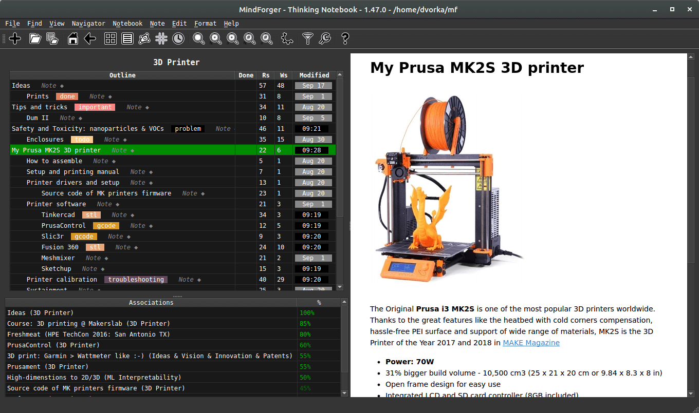

# Home <!-- Metadata: type: Outline; created: 2022-01-12 09:45:45; reads: 200; read: 2024-02-16 13:39:17; revision: 200; modified: 2024-02-16 13:39:17; importance: 0/5; urgency: 0/5; -->
# MindForger Documentation <!-- Metadata: type: Note; created: 2022-01-30 08:59:13; reads: 74; read: 2024-02-16 13:39:17; revision: 74; modified: 2024-02-16 13:39:17; -->

Are you **drowning** in **information**, but starving for knowledge?

Where do you keep your **private remarks** like ideas, personal plans, exam preparation notes, gift tips, how-tos, dreams, business visions, finance strategies, meeting minutes and auto coaching notes? Loads of documents, sketches and remarks spread around the file system, cloud, web and Post-it notes? Are you afraid of your knowledge **privacy**? Are you able to **find** particular remarks once you create them? Do you know how are the remarks mutually **related** when you browse, read or write them? No?

**MindForger** is thinking notebook and [Markdown](https://docs.github.com/en/get-started/writing-on-github/getting-started-with-writing-and-formatting-on-github/basic-writing-and-formatting-syntax) editor:

* [Installation](INSTALLATION.md)
* [Getting started](GETTING_STARTED.md)
* [YouTube tutorials](https://www.youtube.com/playlist?list=PLkTlgXXVRbUDdvysdslnAt_mU15oNPWNS)
* [User documentation](USER_DOCUMENTATION.md)
* [Developer documentation](DEVELOPER_DOCUMENTATION.md)
* [History](HISTORY.md)
* [FAQs](FAQS.md)

**MindForger** aims to be human mind inspired personal knowledge management tool:

* **Human mind**
    * MindForger aims to mimic human mind -
      [learning](USER_DOCUMENTATION.md#learning),
      [recalling](USER_DOCUMENTATION.md#search),
      [recognition](USER_DOCUMENTATION.md#recognize-what-matters),
      [associations](USER_DOCUMENTATION.md#autolinking--associate-as-you-read),
      [forgetting](USER_DOCUMENTATION.md#forgetting) - in order to achieve
      synergy with your mind to make your searching, reading and writing
      more productive.
* **Personal**
    * MindForger enables you to **own** your **personal** data - it's meant to
      store your personal ideas, remarks, notes and plans in a secure way while
      it respects your privacy.
    * MindForger does **not** compete with tools for sharing information like
      Wikis - its primary purpose is to maintain your **private** data.
* **Knowledge**
    * MindForger seeks knowledge hidden in your remarks to enable its mining
      and personal machine learning models creation.
* **Management**
    * MindForger starts where editors and search engines end. It thinks as
      you [search](USER_DOCUMENTATION.md#tays--think-as-you-search),
      [browse](USER_DOCUMENTATION.md#tayb--think-as-you-browse),
      [read](USER_DOCUMENTATION.md#tayr--think-as-you-read) and
      [write](USER_DOCUMENTATION.md#tayw--think-as-you-write).
      Once you **find** a remark, MindForger
      brings its associations. As you **browse** notes and **read** them it looks up
      related relevant knowledge in your notebooks. If you **edit** a remark,
      MindForger brings [associations](USER_DOCUMENTATION.md#tayr--think-as-you-read)
      as you **write**.
      It reminds you about existing content related to the text being written.
    * MindForger is integrated with local **large language models**,
      which brings note-taking and knowledge management to a new level. With the integration,
      MindForger allows you to easily expand your notes and knowledge by leveraging the power
      of artificial intelligence. Whether you need to write an in-depth analysis, draft a blog
      post, or simply generate ideas. Large language model can
      [fix grammar](https://www.youtube.com/watch?v=QLX9CWzzEa8&list=PLkTlgXXVRbUDdvysdslnAt_mU15oNPWNS&index=5&pp=iAQB),
      [translate](https://www.youtube.com/watch?v=akesdLhWZ-I&list=PLkTlgXXVRbUDdvysdslnAt_mU15oNPWNS&index=7&pp=iAQB),
      [write](https://www.youtube.com/watch?v=eyLV5P_Bujs&list=PLkTlgXXVRbUDdvysdslnAt_mU15oNPWNS&index=6&t=5s&pp=iAQB),
      [reformulate](https://www.youtube.com/watch?v=eyLV5P_Bujs&list=PLkTlgXXVRbUDdvysdslnAt_mU15oNPWNS&index=6&t=5s&pp=iAQB),
      [summarize](https://www.youtube.com/watch?v=TAV8tHajjeg&list=PLkTlgXXVRbUDdvysdslnAt_mU15oNPWNS&index=9&pp=iAQB),
      suggest [synonyms and antonyms](https://www.youtube.com/watch?v=Xj0wZz2vBSw&list=PLkTlgXXVRbUDdvysdslnAt_mU15oNPWNS&index=10&pp=iAQB),
      and much more.
      You can now effortlessly generate high-quality content, enhance the organization
      of your knowledge, and collaborate seamlessly with others, all within a single platform.
      MindForger has you covered.
* **Tool**
    * MindForger is a **desktop** application which runs on [Linux](INSTALLATION.md#ubuntu),
      [macOS](INSTALLATION.md#macos) and [Windows](INSTALLATION.md#windows).

Features:

* **[Associations](USER_DOCUMENTATION.md#tayr--think-as-you-read)**
    * **MindForger thinks as you read and write.** While you work on a Note, MindForger
      **associates** it with related Notes from your whole workspace - including those you
      **forgot** you ever wrote. Associations are computed **locally**, with no cloud and no LLM
      required.
* **[Autolinking](USER_DOCUMENTATION.md#auto-linking)**
    * **Links that write themselves.** Names of Notebooks and Notes mentioned in your text are
      **automatically** turned into links in the preview - your hand-written links are rendered in
      blue, generated ones in green - so that your knowledge gets interconnected without any extra
      effort - no need to manually create links, Wiki camel case words or other linking conventions.
* **[Private AI](USER_DOCUMENTATION.md#wingman)**
    * **Assistant that doesn't send your notes anywhere.** Wingman runs open-weight **Large Language
      Models** - like gpt-oss, Llama, GLM or Qwen - **privately on your machine** via
      [ollama](https://ollama.com) to **summarize**, **explain**, **translate**, **rewrite**, fix
      **grammar**, generate **tags** or find **tasks** in the Notes you read and write.
* **[Keyboard First](USER_DOCUMENTATION.md#keyboard-shortcuts)**
    * **Keep your hands on the keyboard.** MindForger is designed to be used **without a mouse** -
      almost every action has a **keyboard shortcut** and every menu item has an **accelerator**.
      Recall a Notebook or Note by name in a few keystrokes, easily restructure the outline,
      complete links to Notes as you type or run commands. Your thoughts flow straight from your
      mind to your notes.
* **[Stencils](USER_DOCUMENTATION.md#stencils)**
    * **Start from structure, not from a blank page.** Create Notebooks from **stencils** - meeting
      minutes, software analysis and design documents, **S.M.A.R.T.E.R.** goals or the **GROW
      model** - and capture thoughts as one of 16 **typed Notes** like idea, question, lesson, task
      or SWOT. Add your own stencils and Note types to fit how you think.
* **[Refactoring](USER_DOCUMENTATION.md#refactoring)**
    * **Refactor your thinking** like source code. MindForger brings IDE style features to your
      notes - **clone**, **promote**, **demote**, **move** and **extract** Notes within one Markdown
      file or **across** many of them, using keyboard shortcuts for extreme efficiency and speed.
* **[Knowledge Graph](USER_DOCUMENTATION.md#knowledge-graph-navigator)**
    * **Walk through your knowledge.** The knowledge graph navigator renders Notebooks, Notes,
      **tags** and their relationships as an interactive **force-directed graph** which you can
      explore node by node - like implicit mind map.
* **[Organizers](USER_DOCUMENTATION.md#organizers--tag-based-aspects)**
    * **Know what to do next.** **Kanban** boards and **Eisenhower matrix** organizers sort your
      Notebooks and Notes by their tags - TODO, WIP, DONE or urgent and important - so you don't
      need another task management app. **Notebook shelves** then let you group Notebooks to as many
      named shelves as you need. **From Notes to Notebooks, from Notebooks to priorities and
      actions.**
* **[No Lock-in](USER_DOCUMENTATION.md#markdown-ide)**
    * **Your files, your tools.** Everything is **plain Markdown** on your disk. Open a MindForger
      workspace, **any** existing **Markdown directory** or just a **single** Markdown **file**.
      Synchronize, share, back up and encrypt your knowledge with the tools you trust - own Git
      server, private [GitHub](https://github.com/) or [Bitbucket](https://bitbucket.org)
      repository, or cloud drive of your choice.
* **[Math & Diagrams](USER_DOCUMENTATION.md#math)**
    * Markdown editor with **live preview**, **syntax highlighting**, offline **KaTeX** math and
      **Mermaid** diagrams, **spell check**, **emojis**, Emacs keybindings, paragraph rewrap,
      **hoist** mode and the option to edit a Note in your favorite external editor.
* **[Docs Library](USER_DOCUMENTATION.md#library)**
    * Index directories with **PDF** documents as Notebooks, keep them in sync and detect
      **orphaned** documents. Study, read and annotate your PDFs conveniently connected with your
      remarks.
* **[Export](USER_DOCUMENTATION.md#csv-export)**
    * Export Notebooks to **HTML** or **Markdown**, or your whole workspace to **CSV** with one-hot
      encoded tags - ready for your machine learning and analytics tools.
* **[Fast & Native](INSTALLATION.md)**
    * Written in **C++** and **Qt**, works completely **offline** and runs on **Linux**, **macOS**
      and **Windows**.

**MindForger** has been released on the day of my [42nd](https://en.wikipedia.org/wiki/42_(number)#The_Hitchhiker's_Guide_to_the_Galaxy) birthday to confirm [answer](https://www.youtube.com/watch?v=aboZctrHfK8) to the Ultimate Question of life, the Universe, and Everything, however, the project has longer [history](HISTORY.md).
