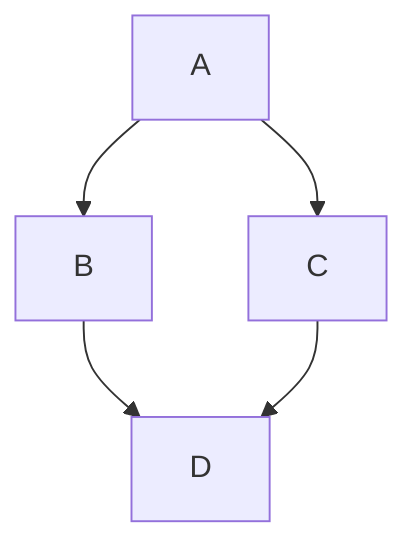
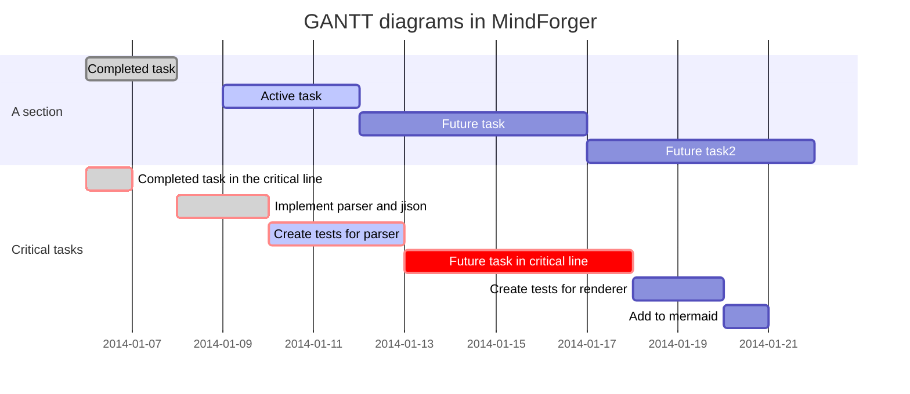

# User documentation <!-- Metadata: type: Outline; created: 2022-01-30 18:02:50; reads: 657; read: 2022-02-05 21:22:03; revision: 657; modified: 2022-02-05 21:22:03; importance: 0/5; urgency: 0/5; -->
Table of contents:

* [Basics](#basics) <kbd>todo</kbd>
    * [Markdown markup](#markdown-markup)
        * [Markdown example](#markdown-example) <kbd>todo</kbd>
        * [Markdown cheat sheet](#markdown-cheat-sheet) <kbd>todo</kbd>
        * [Markdown specification](#markdown-specification) <kbd>todo</kbd>
        * [Markdown document](#markdown-document) <kbd>todo</kbd> <kbd>diagram</kbd>
    * [Document ~ Notebook](#document---notebook) <kbd>todo</kbd>
    * [Section ~ Note](#section---note) <kbd>todo</kbd>
* [Markdown editor](#markdown-editor)
    * [Open Markdown file](#open-markdown-file) <kbd>todo</kbd>
    * [Outline](#outline)
        * [Markdown outline](#markdown-outline)
    * [Outliner](#outliner) <kbd>todo</kbd>
        * [Promote note](#promote-note)
        * [Demote note](#demote-note)
        * [Top](#top)
        * [Up](#up)
        * [Down](#down)
        * [Move note to bottom](#move-note-to-bottom)
        * [Hoisting](#hoisting)
    * [Live Preview](#live-preview)
    * [Live preview](#live-preview)
        * [View and Edit mode](#view-and-edit-mode) <kbd>todo</kbd>
    * [Editor](#editor)
        * [Markdown format](#markdown-format) <kbd>rewrite</kbd>
            * [Text](#text)
            * [Keyboard keys](#keyboard-keys)
            * [Images](#images)
            * [Links](#links)
            * [Smarty pants](#smarty-pants) <kbd>obsolete</kbd>
            * [HR](#hr)
            * [List](#list)
            * [Tasks](#tasks)
            * [Blockquote](#blockquote)
            * [Tables](#tables)
            * [Source code with syntax highlighting](#source-code-with-syntax-highlighting)
            * [Math](#math)
                * [MathJax](#mathjax)
            * [Diagrams](#diagrams)
            * [Comments](#comments)
        * [Link completion](#link-completion)
        * [Drag & Drop Images and Files](#drag---drop-images-and-files)
            * [DnD: Drag & Drop](#dnd--drag---drop)
* [Markdown IDE](#markdown-ide)
    * [Repository](#repository)
        * [Markdown file](#markdown-file)
        * [Markdown directory](#markdown-directory)
        * [MindForger repository](#mindforger-repository)
    * [Open MindForger repository](#open-mindforger-repository)
    * [Open directory with Markdowns](#open-directory-with-markdowns)
        * [Multiple documents](#multiple-documents)
    * [Stencils](#stencils)
    * [Refactoring](#refactoring) <kbd>rewrite</kbd>
        * [Note refactoring](#note-refactoring)
    * [Home notebook](#home-notebook)
* [Search](#search)
    * [Fulltext](#fulltext)
    * [Name](#name)
    * [Tag](#tag)
* [Thinking Notebook](#thinking-notebook)
    * [Thinking vs Sleep mode](#thinking-vs-sleep-mode)
    * [TAYS: Think as you Search](#tays--think-as-you-search)
    * [TAYR: Think as you Read](#tayr--think-as-you-read)
    * [TAYW: Think as you Write](#tayw--think-as-you-write)
    * [TAYB: Think as you Browse - Knowledge Graph Navigator](#tayb--think-as-you-browse---knowledge-graph-navigator)
    * [Recognize what matters](#recognize-what-matters)
        * [Named-entity Recognition](#named-entity-recognition)
        * [Semantic Search and Domain](#semantic-search-and-domain)
    * [Auto-linking: Associate as you Read](#auto-linking--associate-as-you-read)
    * [Scopes](#scopes)
        * [Time Scope](#time-scope)
        * [Tag Scope](#tag-scope)
    * [Forgetting](#forgetting)
        * [Limbo](#limbo) <kbd>todo</kbd>
* [Productivity](#productivity)
    * [Urgency and Importance](#urgency-and-importance)
    * [Eisenhower matrix](#eisenhower-matrix)
        * [Eisenhower matrix on tags](#eisenhower-matrix-on-tags)
    * [Kanban on Tags](#kanban-on-tags)
* [Machine learning: NLP](#machine-learning--nlp)
    * [CSV export](#csv-export) <kbd>todo</kbd>
* [Coaching](#coaching) <kbd>todo</kbd>
    * [GROW model](#grow-model)
* [Tools](#tools)
    * [Terminal](#terminal)
    * [CLI](#cli)
* [Configuration](#configuration)
    * [Appearance and themes](#appearance-and-themes)
    * [Custom HTML Preview CSS](#custom-html-preview-css)
    * [Spell check](#spell-check) <kbd>todo</kbd>
    * [AA poler](#aa-poler)
* [Cheatsheets](#cheatsheets)
    * [MathJax cheatsheet](#mathjax-cheatsheet)
* [Keyboard shortcuts](#keyboard-shortcuts) <kbd>todo</kbd>
* [CLI and man](#cli-and-man)
* [Credits](#credits) <kbd>todo</kbd>

This document _briefly_ describes key MindForger features.
# Basics <!-- Metadata: type: Note; tags: todo; created: 2022-02-05 15:29:18; reads: 37; read: 2022-02-05 17:07:07; revision: 7; modified: 2022-02-05 16:47:44; -->
This section aims to explain basic MindForger terminology:

* [Notebook](#document---notebook)
* [Note](#section---note)
* [Tag](#tags)
* [Repository](#mindforger-repository)
## Markdown markup <!-- Metadata: type: Note; tags: todo; created: 2022-01-30 18:02:50; reads: 66; read: 2022-02-05 17:07:07; revision: 18; modified: 2022-02-05 16:47:15; -->
_... Ink example with simplistic MD: title, 2 sections, funny_

> **Markdown** is a lightweight markup language for creating formatted text using a plain-text editor. John Gruber and Aaron Swartz created Markdown in 2004 as a markup language that is appealing to human readers in its source code form.[9] Markdown is widely used in blogging, instant messaging, online forums, collaborative software, documentation pages, and readme 
files. -- [Wikipedia](https://en.wikipedia.org/wiki/Markdown)

You can write your remarks as **plain text** without any formatting in MindForger.

However, you **may** use [Markdown markup](https://daringfireball.net/projects/markdown/) to emphasize important parts of the text, make links, create lists, etc. MindForger will also use Markdown to store your remarks which enables you to use any Markdown editor or tool.

You don't have to learn [Markdown specification](https://spec.commonmark.org/) as MindForger editor and `Format` menu will help and guide you.
### Markdown cheat sheet <!-- Metadata: type: Note; tags: todo; created: 2022-02-05 15:32:08; reads: 45; read: 2022-02-05 17:07:07; revision: 4; modified: 2022-02-05 15:44:41; -->

### Markdown specification <!-- Metadata: type: Note; tags: todo; created: 2022-02-05 15:32:15; reads: 47; read: 2022-02-05 17:07:07; revision: 3; modified: 2022-02-05 15:44:44; -->

### Markdown document <!-- Metadata: type: Note; tags: todo,diagram; created: 2022-02-05 15:29:57; reads: 56; read: 2022-02-05 17:07:07; revision: 10; modified: 2022-02-05 15:50:53; -->
_...title, description, section, text w/ Inkscape diagram_
## Document ~ Notebook <!-- Metadata: type: Note; tags: todo; created: 2022-02-05 15:29:29; reads: 54; read: 2022-02-05 17:07:07; revision: 7; modified: 2022-02-05 16:48:16; -->
_ink diagram_
## Section ~ Note <!-- Metadata: type: Note; tags: todo; created: 2022-02-05 15:29:47; reads: 56; read: 2022-02-05 17:07:07; revision: 7; modified: 2022-02-05 16:48:39; -->
_ink diagram, basic unit of operations, granularity_

# Markdown editor <!-- Metadata: type: Note; created: 2022-01-30 18:02:50; reads: 31; read: 2022-02-05 17:07:07; revision: 2; modified: 2022-02-05 15:30:33; -->
MindForger can be used as a Markdown **editor**.

It allows you to easily write [Markdown](#markdown) 
documents in a WYSIWYG text editor with
Markdow **syntax** hints and an HTML rendered **preview**.

MindForger terminology:

* A Markdown file is a **Notebook**.
* A Markdown document section (line with leading `#`) is a **Note**.


MindForger represents any Markdown as [follows](#markdown-outline)...
## Markdown file <!-- Metadata: type: Note; created: 2022-01-30 18:02:50; reads: 63; read: 2022-02-05 17:07:07; revision: 4; modified: 2022-02-05 16:27:57; -->
MindForger can be used to edit a **single** Markdown file:

```
mindforger analysis.md
```

If the given file exists, then it's opened for editing, otherwise a
new Markdown file with this name is **created** and opened.
### Open Markdown file <!-- Metadata: type: Note; tags: todo; created: 2022-02-05 15:45:33; reads: 36; read: 2022-02-05 17:07:07; revision: 4; modified: 2022-02-05 16:28:02; -->


BULB: see dir and repo for how to open ...
## Outline <!-- Metadata: type: Note; created: 2022-02-05 15:59:37; reads: 16; read: 2022-02-05 17:07:07; revision: 2; modified: 2022-02-05 15:59:38; -->

### Markdown outline <!-- Metadata: type: Note; created: 2022-01-30 18:02:50; reads: 59; read: 2022-02-05 17:07:07; revision: 2; modified: 2022-02-05 15:59:54; -->
In order to enable quick **navigation** and **refactoring** 
of Markdown documents, MindForger shows Markdown documents (**Notebooks**) 
as an **outline** of Markdown sections (**Notes**) allowing
you to efficiently choose/read/edit/refactor a particular section.


Check side-by-side Markdown document **text view**
and **MindForger view** in the image above:

* The `INSTALLATION` Markdown document is opened in a text editor (Emacs) on the **left**.
* The same Markdown document is opened in MindForger on the **right**.

As you can see, MindForger represents the hierarchy of sections 
(prefixed/underlined in Markdown syntax with/by `#`, `-` or `=`) 
as a **tree** - called an **outline**:

* The tree of sections (in the left MindForger window) reflects 
  the **depth/level** of individual sections e.g. section `UBUNTU` 
  on the second level is prefixed with `##` and shown on the second 
  level in the tree.


* You can **open** Markdown document **title section** (`INSTALLATION`) by
  clicking its name `INSTALLATION` above **outline**.
* Any **sub-section** can be opened by clicking its name in the tree.

For switching between section (pre)view and edit mode refer to the [next section](#view-vs-edit-mode).

## Outliner <!-- Metadata: type: Note; tags: todo; created: 2022-02-05 15:59:46; reads: 33; read: 2022-02-05 17:07:07; revision: 5; modified: 2022-02-05 16:00:55; -->

### Promote note <!-- Metadata: type: Note; created: 2022-02-05 16:00:59; reads: 31; read: 2022-02-05 17:07:07; revision: 4; modified: 2022-02-05 16:01:52; -->

### Demote note <!-- Metadata: type: Note; created: 2022-02-05 16:01:03; reads: 31; read: 2022-02-05 17:07:07; revision: 3; modified: 2022-02-05 16:02:40; -->

### Top <!-- Metadata: type: Note; created: 2022-02-05 16:01:16; reads: 24; read: 2022-02-05 17:07:07; revision: 2; modified: 2022-02-05 16:01:21; -->

### Up <!-- Metadata: type: Note; created: 2022-02-05 16:01:14; reads: 26; read: 2022-02-05 17:07:07; revision: 2; modified: 2022-02-05 16:01:14; -->

### Down <!-- Metadata: type: Note; created: 2022-02-05 16:01:42; reads: 22; read: 2022-02-05 17:07:07; revision: 2; modified: 2022-02-05 16:01:43; -->

### Move note to bottom <!-- Metadata: type: Note; created: 2022-02-05 16:01:26; reads: 23; read: 2022-02-05 17:07:07; revision: 3; modified: 2022-02-05 16:02:13; -->

### Hoisting <!-- Metadata: type: Note; created: 2022-02-05 16:03:46; reads: 18; read: 2022-02-05 17:07:07; revision: 2; modified: 2022-02-05 16:03:46; -->

## Live Preview <!-- Metadata: type: Note; created: 2022-01-30 18:02:50; reads: 45; read: 2022-02-05 17:07:07; revision: 1; modified: 2022-01-30 18:02:50; -->
Easily toggle live HTML preview of edited Markdown
with shortcut or edit panel buttons.
## Live preview <!-- Metadata: type: Note; created: 2022-02-05 16:03:14; reads: 29; read: 2022-02-05 17:07:07; revision: 3; modified: 2022-02-05 16:03:32; -->

### View and Edit mode <!-- Metadata: type: Note; tags: todo; created: 2022-01-30 18:02:50; reads: 62; read: 2022-02-05 17:07:07; revision: 5; modified: 2022-02-05 16:03:25; -->


If you want to **edit** a section either **double-click** anywhere in the 
rendered preview on the right (MindForger window) or choose:

*  menu `Notebook/Edit` for title section
*  menu `Note/Edit` for any sub-section
## Editor <!-- Metadata: type: Note; created: 2022-02-05 16:04:22; reads: 22; read: 2022-02-05 17:07:06; revision: 2; modified: 2022-02-05 16:04:23; -->

### Markdown format <!-- Metadata: type: Note; tags: rewrite; created: 2022-01-30 18:02:50; reads: 45; read: 2022-02-05 17:06:43; revision: 8; modified: 2022-02-05 17:06:43; -->
_... Link to sections about Markdown above ... MAKE ARCHIVE OF THE WHOLE WIKI and PROVIDE it as ZIP (stored in wiki repo) allowing user to download it and edit it as MF repository_

---

[Markdown](https://daringfireball.net/projects/markdown/) is  a plain text formatting syntax introduced by John Gruber.
Markdown allows you to write using an easy-to-read, easy-to-write plain text 
format, easily rendered as HTML.

MindForger uses Markdown-based DSL.
There are many flavors of Markdown - for
Markdown syntax documentation please refer to:

* [John Gruber Markdown syntax](https://daringfireball.net/projects/markdown/syntax) documentation
* [GitHub Markdown](https://help.github.com/articles/basic-writing-and-formatting-syntax/) documentation
* [GitHub flavored Markdown](https://github.github.com/gfm/) specification
* [Mermaid diagrams](https://mermaidjs.github.io/) documentation

Sub-sections of this section provide Markdown syntax
overview and rendering demonstration. As you read
particular Markdown syntax features, be sure to
open each section for **edit** (to check syntax) and
experiment with **menu** `Format/*`.
#### Text <!-- Metadata: type: Note; created: 2022-01-30 18:02:50; reads: 35; read: 2022-02-05 16:49:26; revision: 1; modified: 2022-01-30 18:02:50; -->
`Monospace` text, *emph* text, **bold** text, 
_italic_ text, __bold__ text, ~~deleted~~ text.

---

💡 edit this Note to see the syntax
#### Keyboard keys <!-- Metadata: type: Note; created: 2022-01-30 18:02:50; reads: 35; read: 2022-02-05 16:49:26; revision: 1; modified: 2022-01-30 18:02:50; -->
You can use <kbd>Alt+f b</kbd> to make marked text bold.

---

💡 edit this Note to see the syntax
#### Images <!-- Metadata: type: Note; created: 2022-01-30 18:02:50; reads: 35; read: 2022-02-05 16:49:26; revision: 1; modified: 2022-01-30 18:02:50; -->
See Markdown source of this Note to learn **image** syntax.

Image from web:


Image from current MindForger repository:


---

💡 edit this Note to see the syntax <br/>
💡 click menu `Format/Image` or press <kbd>Alt+f m</kbd> to insert image.
#### Links <!-- Metadata: type: Note; created: 2022-01-30 18:02:50; reads: 35; read: 2022-02-05 16:49:26; revision: 1; modified: 2022-01-30 18:02:50; -->
See Markdown source of this Note to learn **link** syntax.

Link to web:

* [MindForger home page](http://www.mindforger.com)

Automatic web link:

* https://github.com/dvorka/mindforger

Link to a Notebook in active MindForger repository:

* [MF history](./history.md)

Link to a Note in active MindForger repository:

* [MF motivation](./why-mindforger.md#motivation)

Link to a file on the filesystem:

* [.bashrc](/etc/bash.bashrc)

Link to a directory on the filesystem:

* [/tmp](/tmp)

---

💡 edit this Note to see the syntax <br/>
💡 click menu `Format/Link` or press <kbd>Alt+f l</kbd> to insert link.
#### Smarty pants <!-- Metadata: type: Note; tags: obsolete; created: 2022-01-30 18:02:50; reads: 41; read: 2022-02-05 16:49:26; revision: 2; modified: 2022-02-05 15:54:13; -->

[Smarty pants like](https://daringfireball.net/projects/smartypants/) like:

* curly " and '
* ``backsticks''
* dashes a--ha and a---ha
* (tm) and (r) and (c)
* consecutive dots ...
* 1/4 1/2
* A^B and a^(b+2)

---

💡 edit this Note to see the syntax
#### HR <!-- Metadata: type: Note; created: 2022-01-30 18:02:50; reads: 39; read: 2022-02-05 16:49:25; revision: 1; modified: 2022-01-30 18:02:50; -->
Horizontal...

---
... rulers ...

***
... split screen horizontally.
___

#### List <!-- Metadata: type: Note; created: 2022-01-30 18:02:50; reads: 35; read: 2022-02-05 16:49:25; revision: 1; modified: 2022-01-30 18:02:50; -->
Bullet list:

* why
    * ?
- how
    * !
+ what
    * .

Numbered list:

1. why
    1. ?
2. how
    1. ?
3. what
    1. ?

---

💡 edit this Note to see the syntax
#### Tasks <!-- Metadata: type: Note; created: 2022-01-30 18:02:50; reads: 36; read: 2022-02-05 16:49:25; revision: 2; modified: 2022-02-05 15:54:26; -->
Task list:

* [x] skip-gram
    * [ ] bag of words
* [X] GloWe vs. word2vec
    * [ ] word embedding
* [x] stemmer

---

💡 edit this Note to see the syntax
#### Blockquote <!-- Metadata: type: Note; created: 2022-01-30 18:02:50; reads: 36; read: 2022-02-05 16:49:25; revision: 2; modified: 2022-02-05 15:54:34; -->
Riddle:

> frodo and
> glum,
>> riddles
>>> in the dark

---

💡 edit this Note to see the syntax
#### Tables <!-- Metadata: type: Note; created: 2022-01-30 18:02:50; reads: 36; read: 2022-02-05 16:49:25; revision: 2; modified: 2022-02-05 15:54:45; -->
Pets:

Snake | Turtle

----- | ------
Karkulka | Ema

Frontend | Backend
:----- | :------
Qt | C++

---

Columns can be **aligned** to left/right or centered:

Left | Center | Right
:----- | :------: | ------:
This is frontend | This is middle-ware | This is backend
Js | ESB | C++

---

💡 edit this Note to see the syntax
#### Source code with syntax highlighting <!-- Metadata: type: Note; created: 2022-01-30 18:02:50; reads: 34; read: 2022-02-05 16:49:25; revision: 2; modified: 2022-02-05 15:55:32; -->
There are multiple options how a block of source code can be written in Markdown.

**IMPORTANT**: note leading empty lines before code blocks.

---

1) Tab indentation w/o language spec and w/o syntax highlighting:

	public static void main(string[] args) {
    	return 0;
	}

---

2) Code block w/ language spec:

```
    ```java
    ```
```

```java
public static void main(string[] args) {
    return 0;
}
```

or w/o language spec:

```
public static void main(string[] args) {
    return 0;
}
```

---

3) Fenced block w/ language spec:

~~~java
public static void main(string[] args) {
    return 0;
}
~~~

or w/o language spec:

~~~
public static void main(string[] args) {
    return 0;
}
~~~

---

💡 edit this Note to see the syntax
#### Math <!-- Metadata: type: Note; created: 2022-01-30 18:02:50; reads: 31; read: 2022-02-05 16:49:25; revision: 1; modified: 2022-01-30 18:02:50; -->
[MathJax](https://www.mathjax.org/) handles **inline** expressions like: x^2 + y^2 = z^2 or **block** expressions like: $$\frac{D\rho}{Dt} = 0.$$


Check MathJax documentation and/or [cheatsheet](https://math.meta.stackexchange.com/questions/5020/mathjax-basic-tutorial-and-quick-reference) for more examples.

Quadratic equation root: When \(a \ne 0\), there are two solutions to \(ax^2 + bx + c = 0\) and they are
$$x = {-b \pm \sqrt{b^2-4ac} \over 2a}.$$

Sum:
$$\sum_{i=0}^n i^2 = \frac{(n^2+n)(2n+1)}{6}$$

Limit:
$$\lim_{x\to 0}$$

Sqrt:
$$\left(\frac{\sqrt x}{y^3}\right)$$

---

Alternatively you can use https://www.codecogs.com to render
expression to image and include it in Markdown.

---

💡 edit this Note to see the syntax <br/>
💡 if math expressions are **not** rendered, then you must **enable** MathJax using menu `Mind/Adapt/Markdown`
##### MathJax <!-- Metadata: type: Note; created: 2022-01-30 18:02:50; reads: 33; read: 2022-02-05 16:49:25; revision: 1; modified: 2022-01-30 18:02:50; -->
MathJax [cheetsheet](https://math.meta.stackexchange.com/questions/5020/mathjax-basic-tutorial-and-quick-reference):

* use `$` to inline expressions, and `$$` for blocks
* superscript: $x^2$
* subscript: $x_i$
* superscript and subscript: $x^2_i$
* Greek letters:
  $\alpha, \beta, \delta ... \omega, \Delta, ... \Omega$
* groups: for `10^10` you get $10^10$, but `10^{10}` gives $10^{10}$. 
* parenthesis: [, ( and use `\{` for curly braces
* fraction: $\frac{2}{3}$ $\frac{a+b}{c-d}$
* square: $\sqrt{10}$ $\sqrt[3]{\frac xy}$
* exponential: $2^8$
* absolute: $\vert{x}\vert$
* metric: $\Vert{x}\Vert$
* interval: $\langle x, y \rangle$
* sum: $\sum x_i$
* integral: $\int x_i$ $\iint x_i$ $\iiint x_i$
* union: $x \cup y$, $\bigcup x$
* intersection: $x \cap y$, $\bigcap x$
* limit: $\lim_{x\to 0}$
* goniometrical: $\sin x$
* bigger/smaller: $\lt \gt \le \leq \leqq \leqslant \ge \geq \geqq \geqslant$
* not using `n`: $\neq$
* sets: $\cup \cap \setminus \subset \subseteq \subsetneq \supset \in \notin \emptyset \varnothing$
* combinatorics: $\binom{n+1}{2k}$
* arrows: $\to \rightarrow \leftarrow \Rightarrow \Leftarrow \mapsto$
* statements and proofs: $\land \lor \lnot \forall \exists \top \bot \vdash \vDash$
* long dots: $\ldots$
* infinity: $\infty \aleph_0 \nabla \partial$
* limits: $\epsilon \varepsilon$
* vectors and hats: $\hat x, \bar y, \overline{abc}, \vec x$

Limit block:

$$\lim_{x\to 0}$$

#### Diagrams <!-- Metadata: type: Note; created: 2022-01-30 18:02:50; reads: 33; read: 2022-02-05 16:49:25; revision: 1; modified: 2022-01-30 18:02:50; -->
Flowchart diagram:



Sequence diagram - note different Mermaid diagram markup encapsulation element which has different background rendering that code block:

<div class="mermaid">
sequenceDiagram
    participant Alice
    participant Bob
    Alice->>John: Hello John, how are you?
    loop Healthcheck
        John->>John: Fight against hypochondria
    end
    Note right of John: Rational thoughts <br/>prevail!
    John-->>Alice: Great!
    John->>Bob: How about you?
    Bob-->>John: Jolly good!
</div>

GANTT diagram:



---

💡 edit this Note to see the syntax <br/>
💡 if math expressions are **not** rendered, then you must **enable** them using menu `Mind/Adapt/Markdown`
#### Comments <!-- Metadata: type: Note; created: 2022-01-30 18:02:50; reads: 32; read: 2022-02-05 16:49:25; revision: 1; modified: 2022-01-30 18:02:50; -->
If you want **line** or **multi-line** comment that 
is strictly for yourself (readers of the converted 
document should not be able 
to see it, even with "view source") you could (ab)use 
the link labels (for use with reference style links) 
that are available in the core Markdown specification.

**Single line comment**:

[comment]: # (This is a comment, you cannot see it)

**Multi-line comment**:

[comment]: # (This is a comment)
[comment]: # (that spans multiple lines)
[comment]: # (and you cannot see it)

Note that two conditions are **important**:

* Using `#` (and not other delimiter allowed by Markdown specification)
* An empty line before the comment. Empty line after the comment has no impact on the result.

---

If you need **inline** comment, then use HTML comments:

* There is <!-- secret --> you cannot see.

---

💡 edit this Note to see the syntax
### Drag & Drop Images and Files <!-- Metadata: type: Note; created: 2022-01-30 18:02:50; reads: 35; read: 2022-02-05 16:49:25; revision: 3; modified: 2022-02-05 16:04:43; -->
_This feature is being implemented._
#### DnD: Drag & Drop <!-- Metadata: type: Note; created: 2022-01-30 18:02:50; reads: 44; read: 2022-02-05 16:49:25; revision: 3; modified: 2022-02-05 16:00:24; -->
Drag:

* **file**
    * ... for example `.pdf`, presentation or `.zip` archive
* **image**
    * ... `.png`, `.gif`, ... or any other image
* **image data**
    * ... screenshot or image selection from Gimp, Krita or any other graphics editor

... and **drop** to Note/Notebook editor.

DnD allows easy import of attachments/images to MindForger
repository - either by value (choose `Copy` in attachment/image
dialog) or by reference (path to the file on local file system
is used).
### ToC generator <!-- Metadata: type: Note; created: 2022-02-05 16:37:59; reads: 17; read: 2022-02-05 16:49:25; revision: 6; modified: 2022-02-05 16:38:32; -->

### Link completion <!-- Metadata: type: Note; created: 2022-01-30 18:02:50; reads: 51; read: 2022-02-05 16:49:25; revision: 2; modified: 2022-02-05 16:04:24; -->
While editing a Note or Notebook write prefix of
a Notebook/Note name and use <kbd>Ctrl-/</kbd> to 
get link completion. When you choose a link from completer,
Markdown link to target Notebook/Note is automatically created.
# Markdown IDE <!-- Metadata: type: Note; created: 2022-01-30 18:02:50; reads: 25; read: 2022-02-05 16:49:25; revision: 2; modified: 2022-02-05 15:30:31; -->
MindForger is more than just Markdown editor - it is integrated development environment (**IDE**) 
for the development of Markdown document collections (repositories, documentation, books, etc.):

* **multiple** Markdown documents can be opened in order to perform search, refactoring
  and analytics
* user defined **stencils** can be used to quickly create new notebooks and notes
* notebook **structure** can be easily refactored with outliner-style operations
  defined on notes
* both notebooks and notes can be **refactoried** withing or across different notebooks and notes
## Open Markdown directory <!-- Metadata: type: Note; created: 2022-01-30 18:02:50; reads: 28; read: 2022-02-05 16:49:25; revision: 3; modified: 2022-02-05 16:28:20; -->
You can open **any** directory and MindForger will find
all Markdown files within the directory and its sub-directories
and open them for search, navigation and editing:

```
$ mindforger a-git-repository-with-interesting-content
```

For example, you can find an [interesting Git repository](#markdown-content-and-examples)
on GitHub or BitBucket, clone it to your machine and open it 
with MindForger to easily navigate it.
## Open directory with Markdowns <!-- Metadata: type: Note; created: 2022-02-05 15:45:45; reads: 96; read: 2022-02-05 16:49:25; revision: 8; modified: 2022-02-05 15:49:14; -->

### Multiple documents <!-- Metadata: type: Note; created: 2022-01-30 18:02:50; reads: 23; read: 2022-02-05 16:49:25; revision: 2; modified: 2022-02-05 15:58:37; -->


You can open **any** directory and MindForger will find
all Markdown files within that directory and all its 
sub-directories and make them available for search, navigation 
and editation:

```
$ mindforger a-github-repository-with-interesting-content
```

Where `a-github-repository-with-interesting-content` is a directory
containing Markdown documents.

---

💡 if you openeded more than one MindForger document, you can see all documents indexed by MindForger by clicking menu `View/Notebooks`
## Stencils <!-- Metadata: type: Note; created: 2022-01-30 18:02:50; reads: 24; read: 2022-02-05 16:49:25; revision: 1; modified: 2022-01-30 18:02:50; -->


Stencil represents a common pattern that can be used in
various situations e.g. to solve a task. It might be a how to 
(like how to change a car wheel) that **once created**, you 
may want to use **repeatedly** w/ possibility of customization.

Notebook stencil corresponds to application of 
a problem/semantic domain to another problem. 
Once you have a _modus operandi_ or you know how to 
do that, than this is the case.

You can use a stencil when creating a **new** notebook
or note - check `Stencils` drop-down in the dialog
opened using menu `Notebook/New` or `Note/New`.

[MindForger repositories](#mindforger-repository) (including 
the default one) contain stencils for both notebooks and notes:

```
<mindforger repository>/
├── ...
└── stencils
    ├── notebooks
    └── notes
```

MindForger is shipped with an initial set of stencils for meeting
notes, software analysis/design, [GROW model](https://en.wikipedia.org/wiki/GROW_model)
etc. 

You can easily **extend** outlines just by copying Markdown file
to `stencils/notes` or `stencils/notebooks` directory.
## Refactoring <!-- Metadata: type: Note; tags: rewrite; created: 2022-01-30 18:02:50; reads: 25; read: 2022-02-05 16:49:25; revision: 3; modified: 2022-02-05 15:59:10; -->


Hierarchy of **Notes** (Markdown document sections) can be easily
changed using operations introduced by [outliners](https://en.wikipedia.org/wiki/Outliner).
**Note** can be...

* moved up
* moved down
* demoted ~ moved deeper in Notes hierarchy
* promoted ~ moved lower in depth
* ... and more

To manipulate a note, choose it in the **outline view** (tree of notes/Markdown sections 
on the left) and either use shortcuts (<kbd>ctrl+up</kbd>, <kbd>ctrl+down</kbd>, 
<kbd>ctrl+left</kbd>, <kbd>ctrl+right</kbd>) or menu `Note/Promote`, ...
### Note refactoring <!-- Metadata: type: Note; created: 2022-01-30 18:02:50; reads: 24; read: 2022-02-05 16:49:25; revision: 3; modified: 2022-02-05 15:59:15; -->
Note (Markdown section) can be refactoring (along with its child notes)
between different Notebooks (Markdown documents):

* choose **source** note to be refactored in the outliner tree of notes
* use menu `Note/Refactor` to specify **target** notebook

Note and its child notes will be moved to the target notebook.
## Home notebook <!-- Metadata: type: Note; created: 2022-01-30 18:02:50; reads: 27; read: 2022-02-05 16:49:25; revision: 3; modified: 2022-02-05 16:09:22; -->
You can mark any notebook as **home** and it will be opened:

* on MindForger start
* using <kbd>Ctrl</kbd><kbd>Shift</kbd><kbd>h</kbd> keyboard shortcut

Home notebook can be **set**/unset using menu `Navigator/Make Home`.
# Search <!-- Metadata: type: Note; created: 2022-01-30 18:02:50; reads: 25; read: 2022-02-05 16:49:25; revision: 3; modified: 2022-02-05 16:05:37; -->
Ability to find a specific Notebook or Note is one of the 
most important MindForger features. Notebooks and Notes
can be found by:

* full-text search (content)
* name
* tag(s)

---

💡 see menu `Recall` for search options
## Fulltext <!-- Metadata: type: Note; created: 2022-01-30 18:02:50; reads: 19; read: 2022-02-05 16:49:25; revision: 1; modified: 2022-01-30 18:02:50; -->
Use menu `Recall/Full-text Search` to search for **notes**
using full-text search. Result shows notes Markdown source
with **highlighted** matches.

Search **scope**:

* If you run full-text search from notebooks
  view (menu `View/Notebooks`), then **all** notebooks and their
  notes are searched.
* If you run full-text search when a notebook is opened
  (notes outline on the left, note view/editor on the right),
  then **only** notes of that particular notebook are searched.
## Name <!-- Metadata: type: Note; created: 2022-01-30 18:02:50; reads: 19; read: 2022-02-05 16:49:25; revision: 1; modified: 2022-01-30 18:02:50; -->
Use menu `Recall/Recall Notebook by Name` / `Recall/Recall Note by Name`
to search for **notebooks** / **notes** by name. Result shows as you
write the name in the dialog.

Search **scope**:

* If you run note search **by name** from notebooks
  view (menu `View/Notebooks`), then **all** notebooks notes
  are searched.
* If you run note search **by name** when a notebook is opened
  (notes outline on the left, note view/editor on the right),
  then **only** notes of that particular notebook are searched.
## Tag <!-- Metadata: type: Note; created: 2022-01-30 18:02:50; reads: 15; read: 2022-02-05 16:49:25; revision: 1; modified: 2022-01-30 18:02:50; -->
Use menu `Recall/Recall Notebook by Tag` / `Recall/Recall Note by Tag`
to search for **notebooks** / **notes** by tag(s). Result shows as you
add/remove tags in the dialog.

Search **scope**:

* If you run note search **by tag** from notebooks
  view (menu `View/Notebooks`), then **all** notebooks notes
  are searched.
* If you run note search **by tag** when a notebook is opened
  (notes outline on the left, note view/editor on the right),
  then **only** notes of that particular notebook are searched.
# Thinking Notebook <!-- Metadata: type: Note; created: 2022-01-30 18:02:50; reads: 17; read: 2022-02-05 16:49:25; revision: 1; modified: 2022-01-30 18:02:50; -->
MindForger aims to mimic human mind - **learning**, **recalling**, 
**recognition**, **associations**, **forgetting** - in order to achieve 
synergy with your mind to make your searching, reading and writing more 
productive:

* **learning**: MindForger loads Markdown document(s), parses them and construct [knowledge graph](#knowledge-graph-navigator) 
* **recalling**: you can recall notebooks/notes by content, name, tags, semantic domain, ...
* **recognition**: MindForger is able to recognize people, organization, places, ... in your remarks
* **associations**: MindForger suggests relevant notes as you browse, read and edit notebooks and notes
* **forgetting**: MindForger handles the process of scoping and forgetting analogous to human mind
## Learning <!-- Metadata: type: Note; tags: todo; created: 2022-02-05 16:25:34; reads: 30; read: 2022-02-05 16:49:25; revision: 4; modified: 2022-02-05 16:29:13; -->
_...learning data, relationships, similarity (granularity N and O), relevancy in time (timestamps and R/W count), ..._

MindForger can be used to learn:

* manage knowledge in a [MindForger repository](#mindforger-repository)
* edit single [Markdown file](#markdown-file)
* edit [multiple Markdown files](#markdown-directory) in given (sub)directories
### MindForger repository <!-- Metadata: type: Note; created: 2022-01-30 18:02:50; reads: 49; read: 2022-02-05 16:49:25; revision: 5; modified: 2022-02-05 16:26:25; -->
MindForger repository is a directory with specific 
[structure](developer-documentation.md#repository-layout) 
where MindForger stores your **knowledge**. It contains Markdown 
files ([Markdown hosted DSL](developer-documentation.md#markdown-hosted-dsl)) 
allowing you to get most of MindForger capabilities.

If you run MindForger without parameters, then it opens the
default MindForger repository:

```
$ mindforger
```

If MindForger default repository doesn't exist, then it is created
on MindForger first start in:

```
~/mindforger-repository
```

Repository structure looks like this:

```
$ tree mindforger-repository/

mindforger-repository/
├── limbo
├── memory
├── mind
└── stencils
    ├── notebooks
    └── notes
```
## Metadata <!-- Metadata: type: Note; created: 2022-02-05 16:25:47; reads: 10; read: 2022-02-05 16:49:25; revision: 4; modified: 2022-02-05 16:30:41; -->

### Tags <!-- Metadata: type: Note; created: 2022-02-05 16:30:31; reads: 10; read: 2022-02-05 16:49:25; revision: 4; modified: 2022-02-05 16:30:33; -->

### Read/write statistics <!-- Metadata: type: Note; created: 2022-02-05 16:39:08; reads: 8; read: 2022-02-05 16:49:24; revision: 2; modified: 2022-02-05 16:39:09; -->

### Progress <!-- Metadata: type: Note; created: 2022-02-05 16:39:21; reads: 10; read: 2022-02-05 16:49:24; revision: 2; modified: 2022-02-05 16:39:21; -->

### Deadlines <!-- Metadata: type: Note; created: 2022-02-05 16:39:13; reads: 10; read: 2022-02-05 16:49:24; revision: 2; modified: 2022-02-05 16:39:14; -->

### Things and types <!-- Metadata: type: Note; created: 2022-02-05 16:39:33; reads: 10; read: 2022-02-05 16:49:24; revision: 4; modified: 2022-02-05 16:40:06; -->

### Relationships <!-- Metadata: type: Note; created: 2022-02-05 16:40:10; reads: 8; read: 2022-02-05 16:49:24; revision: 2; modified: 2022-02-05 16:40:10; -->

## Auto-linking <!-- Metadata: type: Note; created: 2022-01-30 18:02:50; reads: 63; read: 2022-02-05 16:49:24; revision: 5; modified: 2022-02-05 16:35:46; -->
_...animated screenshot..._


Autolinking discovers relevant notes in your MindForger repository and/or Markdown document
and automatically injects links to the text. In the screenshot above all links were injected
i.e. source text (Markdown) is just plain text without links.

Autolinking helps in immediately finding remarks related to the notebooks and notes you 
are browsing.

Autolinking also saves the time - you don't have to create/change/maintain links in your
remarks.

Tips and tricks:

* If note name contains `:`, then **only** text preceding `:` is used for matching.
    * Example: if "GPS: General positioning system" is note name, then text is searched for "GPS" only
      as it brings more matcheds.
* Autolinking can be configured so that it performs **case insensitive search** for the first letters
  in note names.
    * Example: if "Stencils" is note name, then text is searched **also** for "stencils"
      as it brings more matcheds.
* Autolinking can be quickly toggled using menu.
     
## TaYR: Think as you Read <!-- Metadata: type: Note; created: 2022-01-30 18:02:50; reads: 33; read: 2022-02-05 16:49:24; revision: 3; modified: 2022-02-05 16:41:49; -->


MindForger is able to **suggest relevant notes** as you browse and
read:

* relevant notes are computed for the note being currently **selected**
* relevant notes are shown in the **lower left corner** by `Associations` table
* similarity score in the `Associations` table indicates **relative relevancy** in %


In the screenshot above you can see relevant notes (lower left corner) for the selected
note `My 3D Printer MK2S by Prusa RESEARCH`.

See also: [think vs. sleep mode](#think-vs--sleep-mode)
## TaYW: Think as you Write <!-- Metadata: type: Note; created: 2022-01-30 18:02:50; reads: 30; read: 2022-02-05 16:49:24; revision: 2; modified: 2022-02-05 16:16:50; -->


MindForger is able to **suggest relevant notes** as you write note
content in the editor:


* relevant notes are computed for the **word under the cursor**
* relevant notes are shown in the **lower left corner** by `Associations` table
* similarity score in the `Associations` table indicates **relative relevancy** in %


In the screenshot above you can see relevant notes (lower left corner) for the selected
word `graph` (notice cursor between letter `g` and `r` on the current line with light-gray background).
## TaYS: Think as you Search <!-- Metadata: type: Note; created: 2022-01-30 18:02:50; reads: 50; read: 2022-02-05 16:49:24; revision: 4; modified: 2022-02-05 16:33:28; -->
_... semantic domains - this feature is being implemented._
## TaYB: Think as you Browse <!-- Metadata: type: Note; created: 2022-01-30 18:02:50; reads: 35; read: 2022-02-05 16:49:24; revision: 4; modified: 2022-02-05 16:33:59; -->


**Knowledge graph navigator** allows you to browse notebooks, notes, tags and other resources
in **visually**.

Navigator can be either activated using toolbar or using <kbd>Ctrl</kbd><kbd>Shift</kbd><kbd>k</kbd> keyboard
shortcut. It is **scope sensitive** e.g. if you activate navigator while viewing note, then this note
becomes central node of the visualization.

Knowledge graph can be **zoomed**, **shuffled** and its edgest can be (globally) stretched/shrinked.

_... how exactly it thinks and why it's useful_
### Knowledge graph navigator <!-- Metadata: type: Note; tags: todo; created: 2022-02-05 16:32:10; reads: 19; read: 2022-02-05 21:22:03; revision: 5; modified: 2022-02-05 21:22:03; -->
> _"I hear, and I forget; I see, and I remember." -- Chinese proverb_


## Recognize what matters <!-- Metadata: type: Note; tags: todo; created: 2022-01-30 18:02:50; reads: 36; read: 2022-02-05 21:21:35; revision: 2; modified: 2022-02-05 16:36:05; -->

### Named-entity recognition <!-- Metadata: type: Note; created: 2022-01-30 18:02:50; reads: 32; read: 2022-02-05 21:21:35; revision: 2; modified: 2022-02-05 16:49:12; -->


_This feature is being implemented._
### Semantic search and domains <!-- Metadata: type: Note; created: 2022-01-30 18:02:50; reads: 28; read: 2022-02-05 21:21:35; revision: 2; modified: 2022-02-05 16:51:08; -->
_This feature is being implemented._

Word embeddings based search, associations and navigation.
## Scopes <!-- Metadata: type: Note; created: 2022-02-05 16:11:27; reads: 24; read: 2022-02-05 21:21:35; revision: 2; modified: 2022-02-05 16:11:27; -->

### Time Scope <!-- Metadata: type: Note; created: 2022-01-30 18:02:50; reads: 37; read: 2022-02-05 21:21:34; revision: 3; modified: 2022-02-05 16:11:32; -->
Use menu `Mind/Scope` or <kbd>Alt+m c</kbd> to configure **time** scope.

---

Consider the following situations:

* Over the years your employer company internal systems change and/or
  you work for a number of different employers. Each time there is 
  a different/better/stronger 
  Wifi authentication configuration (video conference
  setup, payslips system, etc.). Therefore in you memory (or in MindForger
  remarks) there are **multiple** how-tos, but you want to use
  only the **recent** want. At the same time you do not want to
  (explicitly) remove/purge the previous how-tos as they can be useful in different
  situations.

* You learn how to manually divide two long numbers as a child.
  Then you do **not** need this skill **for years** as you use calculator/computer.
  When you want to learn your child how to manually divide numbers,
  you have to find it (deep) in your memory.

This is where MindForger **time scope** functionality comes in - you can 
restrict the scope (notes working set) by **time**. For example:

* you work on a project and want to see only notes you modified **today**
* whenever you use MindForger you want to work with notes not older
  than **18 months**
* when reading/working with your employer internal systems how-to **notebook** you want to
  see only notes younger than **1 year**

In particular you can set **global** time scope:

* Notebooks listing: 
    * Only **noteboks** within given time scope (younger) will be shown.
* Add/forget notebook:
    * Notebooks can be added/forgotten.
* Notebook's note tree view: 
    * Only notes within given time scope will be shown.
      If note **is** within timescope and note's parent notes are **not**, then note **is**
      shown along with its parents (parents would be normally hidden). In other words, fresh note
      ensures its parents are shown.
* Add/remove note: 
    * Notes can be added/forgotten.
    * **IMPORTANT**: remember that note can be forgotten **along with its child notes** that can be
      hidden (if they didn't match time scope) i.e. you may delete notes you don't see.
* Promote/demote/up/down note:
    * Notes can be added/forgotten.
    * **IMPORTANT**: remember that these operations work on the **non-filtered* model i.e.
      you perform operation (e.g. up), nothing seems to happen, but the note was just moved above
      a hiddin note that is not in scope i.e. you refactor notes you don't see.
* Note refactoring:
    * Notes can be refactoring (to other notebook) and extracted.
    * **IMPORTANT**: remember that note can be refactored **along with its child notes** that can be
      hidden (if they didn't match time scope) i.e. you may move notes you don't see.
     
In particular you can set **note** specific time scope that overrides global time scope:

* ... behaviour is the same as above except that this setting has no effect on notebooks listing ...
### Tag Scope <!-- Metadata: type: Note; created: 2022-01-30 18:02:50; reads: 33; read: 2022-02-05 21:21:34; revision: 3; modified: 2022-02-05 16:11:34; -->
Use menu `Mind/Scope` or <kbd>Alt+m c</kbd> to configure **tag(s)** scope.

---

Scoping using **tag(s)** allows you to limit notebook **working set** only
to notebooks having specified set of tags. It's useful when you work with
bigger MindForger repositoriers and you don't want to be distracted by
unrelated notebooks.

Scoping using tags can be combined (`AND`) with [scoping using time](#time-scope).
## Forgetting <!-- Metadata: type: Note; created: 2022-01-30 18:02:50; reads: 30; read: 2022-02-05 21:21:34; revision: 1; modified: 2022-01-30 18:02:50; -->
> Motto: "Computers need to forget". -- [Viktor Mayer-Schönberger](http://blog.mindforger.com/2007/11/computers-need-to-forget.html)

Before I deep dive to MindForger features let me formulate
a few questions to explain the motivation behind 
forgetting/scoping related functionality:

* Do we forget or we simply don’t remember?
* When we forget?
* How and where exactly forgetting in our minds happens?
* If we remember something, can it be forgotten?
* Do we need to forget and why?

I believe that if a concept makes it to long term memory
(LTM), then it can be never forgotten. It’s in LTM and 
it always be there. The only question is how many 
association/links it has. In the worst case it may happen 
that there is no association path it it - it ends as an
island or orphan better said. If it’s not reminded or not 
used for long time, association can get weaker and weaker 
and such concepts is diving deeper and deeper to LTM. However,
it is always there. Thus it’s just about the lookup. 
According to my experience a strong emotional experience or 
return to the deeper paths of LTM (talking about your friends 
or family about your early childhood) helps to remind such
concepts and in the latter case even strongly bind them 
to upper level LTM (move them up in the memory) and 
refresh such memories so that you can remind them later 
much more easier.

If there would be no possibility of the selection of sensed
informations and all the sensing will be fixed in our 
memory, its capacity would be fully used very soon.

MindForger, as computer program, needs to forget. But
forgetting does **NOT** mean deleting of information.

MindForger maintains **all** the remarks you ever written
(see [limbo](#limbo)), but works with/shows only with 
a [scope](#time-scope) **configurable** by you.
### Limbo <!-- Metadata: type: Note; tags: todo; created: 2022-01-30 18:02:50; reads: 19; read: 2022-02-05 21:21:34; revision: 3; modified: 2022-02-05 16:11:55; -->
_... Notebooks vs. Note limbo_

MindForger does **not** **delete** notebooks - it moves them to a location called Limbo that
can be found in `${ACTIVE_MF_REPOSITORY}/limbo`. This is where you can delete Markdown
documents permanently.

MindForger, in its current implementation, **does** delete notes. They are not moved to a note Limbo.
If you use menu `Note/Forget`, then the note is deleted. 

Side note: I personally use CMS (Git) - I have full history of notebooks and notes. Tracking of
all notes would be useful, however HW resource consumption intensive. This is also
why I don't want to duplicate this (already sophisticated) functionality within MindForger.
# Productivity <!-- Metadata: type: Note; created: 2022-01-30 18:02:50; reads: 19; read: 2022-02-05 21:21:34; revision: 1; modified: 2022-01-30 18:02:50; -->
MindForger aims to help you when you study, write a document/paper/article/book or
want to achieve a goal.

Therefore it enables you to...

* prioritize work on notebooks using **urgency** and **importance**
* helps you to decide what you do first and next using **Eisenhower matrix**
* track **progress** in %
* specify **deadlines** (for notes)
## Urgency and Importance <!-- Metadata: type: Note; created: 2022-01-30 18:02:50; reads: 19; read: 2022-02-05 21:21:34; revision: 1; modified: 2022-01-30 18:02:50; -->


When creating (menu `Notebook/New`) or editing **notebook** (edit mode `More...` button) you
can specify:

* **importance** property ~ how important is the notebook
* **urgency** property ~ how important is (study/challenge/...) task related to notebook (or notebook content itself)


These properties are in turn shown in **notebooks view** (menu `View/Notebooks`) and [Eisenhower matrix](#eisenhower-matrix).
## Eisenhower matrix <!-- Metadata: type: Note; created: 2022-01-30 18:02:50; reads: 19; read: 2022-02-05 21:21:34; revision: 1; modified: 2022-01-30 18:02:50; -->


**Wikipedia**: [Eisenhower matrix](https://en.wikipedia.org/wiki/Time_management#The_Eisenhower_Method) stems from a quote attributed to Dwight D. Eisenhower: "I have two kinds of problems, the urgent and the important. The urgent are not important, and the important are never urgent."

Using the Eisenhower Decision Principle, tasks are evaluated using the criteria [important/unimportant](#urgency-and-importance) and [urgent/not urgent](#urgency-and-importance), and then placed in according quadrants in an **Eisenhower Matrix** (also known as an "Eisenhower Box" or "Eisenhower Decision Matrix"). Tasks are then handled as follows:

Tasks in

1. **Important/Urgent quadrant** are done immediately and personally e.g. crises, deadlines, problems.
1. **Important/Not Urgent quadrant** get an end date and are done personally e.g. relationships, planning, recreation.
1. **Unimportant/Urgent quadrant** are delegated e.g. interruptions, meetings, activities.
1. **Unimportant/Not Urgent quadrant** are dropped e.g. time wasters, pleasant activities, trivia.

This method is said to have been used by U.S. President Dwight D. Eisenhower.
### Eisenhower matrix on tags <!-- Metadata: type: Note; created: 2022-01-30 18:02:50; reads: 17; read: 2022-02-05 21:21:34; revision: 1; modified: 2022-01-30 18:02:50; -->

## Kanban on Tags <!-- Metadata: type: Note; created: 2022-01-30 18:02:50; reads: 19; read: 2022-02-05 21:21:34; revision: 1; modified: 2022-01-30 18:02:50; -->

# Machine learning: NLP <!-- Metadata: type: Note; created: 2022-02-05 16:12:17; reads: 11; read: 2022-02-05 21:21:25; revision: 7; modified: 2022-02-05 21:21:25; -->
> _"Artificial intelligence will overcome natural intelligence soon. However, natural stupidity can never be replaced by the artificial one." -- Jára da Cimrman_
## CSV export <!-- Metadata: type: Note; tags: todo; created: 2022-02-05 16:12:24; reads: 9; read: 2022-02-05 16:36:43; revision: 4; modified: 2022-02-05 16:12:46; -->
_... document OHE encoding..._
# Coaching <!-- Metadata: type: Note; tags: todo; created: 2022-02-05 16:10:27; reads: 17; read: 2022-02-05 16:36:43; revision: 3; modified: 2022-02-05 16:10:39; -->

## GROW model <!-- Metadata: type: Note; created: 2022-02-05 16:10:34; reads: 10; read: 2022-02-05 16:36:43; revision: 3; modified: 2022-02-05 16:10:35; -->

# Tools <!-- Metadata: type: Note; created: 2022-02-05 16:12:59; reads: 8; read: 2022-02-05 16:36:43; revision: 2; modified: 2022-02-05 16:12:59; -->

## Terminal <!-- Metadata: type: Note; created: 2022-02-05 16:13:03; reads: 8; read: 2022-02-05 16:36:44; revision: 3; modified: 2022-02-05 16:13:05; -->

## CLI <!-- Metadata: type: Note; created: 2022-02-05 16:13:07; reads: 12; read: 2022-02-05 16:36:44; revision: 2; modified: 2022-02-05 16:13:07; -->

# Cheatsheets <!-- Metadata: type: Note; created: 2022-01-30 18:02:50; reads: 19; read: 2022-02-05 16:36:44; revision: 1; modified: 2022-01-30 18:02:50; -->
See MindForger cheetsheet(s):

* [Keyboard Shortcuts](#keyboard-shortcuts)
## MathJax cheatsheet <!-- Metadata: type: Note; created: 2022-01-30 18:02:50; reads: 19; read: 2022-02-05 16:36:44; revision: 1; modified: 2022-01-30 18:02:50; -->
See [MathJax](#mathjax).
# Keyboard shortcuts <!-- Metadata: type: Note; tags: todo; created: 2022-01-30 18:02:50; reads: 19; read: 2022-02-05 16:36:45; revision: 4; modified: 2022-02-05 16:08:56; -->
_... per-platform + explain how to navigate using ALT, suggest tooltips to determine shortcuts, list THE MOST IMPORTANT only here_

Prefer menu based keyboard shortcuts which are self-documented e.g.

* <kbd>Alt+o n</kbd>
    * create new notebook
* <kbd>Alt+o e</kbd>
    * edit currently viewed notebook
* <kbd>Alt+n n</kbd>
    * create new note
* <kbd>Alt+n e</kbd>
    * edit currently viewed note
* ... and many others...


Editor:

* <kbd>Alt+Left</kbd>
    * ... save Note, leave editor and show rendered HTML.
* <kbd>Ctrl+g</kbd>
    * ... cancel editation and leave editor without saving

Views:

* <kbd>Ctrl+Shift+o</kbd>
    * ... recall n**o**tebook.
* <kbd>Ctrl+Shift+n</kbd> 
    * ... recall **n**ote.
# CLI and man <!-- Metadata: type: Note; created: 2022-01-30 18:02:50; reads: 53; read: 2022-02-05 16:50:07; revision: 1; modified: 2022-01-30 18:02:50; -->
For information on MindForger command line options read the manual page:

```shell
man mindforger
```
For command options see the help file:

```shell
$ mindforger --help

Usage: mindforger [options] [<directory>|<file>]
Thinking notebook.

Options:
  -t, --theme <theme>            Use 'dark', 'light' or other GUI <theme>.
  -c, --config-file-path <file>  Load configuration from given <file>.
  -v, --version                  Displays version information.
  -h, --help                     Displays this help.

Arguments:
  [<directory>|<file>]           MindForger repository or directory/file with
                                 Markdown file(s) to open
```
# Content <!-- Metadata: type: Note; tags: todo; created: 2022-02-05 16:50:23; reads: 10; read: 2022-02-05 16:52:43; revision: 4; modified: 2022-02-05 16:52:43; -->
_example content, how to open it, link it from MD sections at the beginning of doc - list it here, awesome-markdown-repositories/ update and copy paste here, link and encourage to suggest_

# Credits <!-- Metadata: type: Note; tags: todo; created: 2022-02-05 16:15:04; reads: 13; read: 2022-02-05 16:50:15; revision: 3; modified: 2022-02-05 16:15:12; -->

